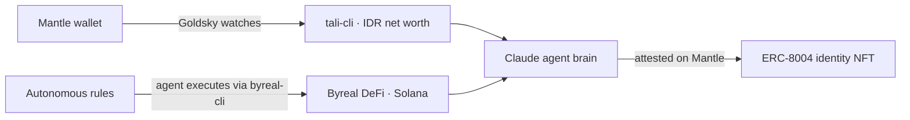

# Tali

> Your money, stitched together — onchain and off — with an agent that acts, and data only you can unlock.

Built for the **Mantle Turing Test Hackathon 2026** (Phase 2 "AI Awakening"). Deadline: **2026-06-15 15:59**.

## One-line pitch

*An autonomous financial agent for Southeast Asian users who live across two financial systems: Indonesian bank accounts and onchain crypto wallets — unified, visible, and acting on rules you set.*

## The three problems Tali solves

### 1. Visibility
No single tool shows an Indonesian crypto-native user their complete financial picture. Bank apps show IDR. Wallet explorers show onchain. Nothing connects them.

Tali: unified IDR net worth across Mantle wallets — one number, real value.

### 2. Autonomous agency
Set a rule: *"whenever USDT comes into my wallet, farm 10% yield on Byreal."* Tali watches your wallet via Goldsky webhooks, executes on Byreal/Solana when triggered, and attests each action under its own on-chain identity (ERC-8004 NFT on Mantle). Every autonomous action is signed, verifiable, and permanent.

### 3. Real DeFi execution
`byreal-cli` runs production Byreal CLMM strategies. Not a demo — real yield, real positions, real transactions on Solana.



## Current status

### Built — week 1
- `tali-cli networth` — live Mantle balances + IDR total via CoinGecko
- `tali-cli` OpenClaw skill manifest (`backend/skills/tali/SKILL.md`)
- Goldsky HMAC-verified webhook server — real-time onchain event ingestion
- Unified event ledger schema (`users`, `events`, `watchedWallets`) via Drizzle ORM
- Privy server SDK: Mantle wallet creation

### Building — week 2+
- `AutonomousRule.sol` + ERC-8004 NFT on Mantle (see `plans/week-2.md`)
- Rule setup flow: NL → Privy signature → contract
- Web dashboard (Next.js + Vercel)

## Competitive moat

1. **ERC-8004 on-chain agent identity** — every autonomous action publicly verifiable on Mantle, not in a private SaaS DB
2. **Real DeFi execution** — `byreal-cli` runs production Byreal CLMM strategies, not a mock
3. **IDR-native** — net worth in Rupiah, designed for Indonesian crypto-active users; Western tools ignore this market
4. **Agentic Economy Path B** — Tali extends Byreal into real-life financial management; the full loop from rule to execution to attestation
5. **P2P trade reconciliation** (roadmap) — links crypto outflow + IDR inflow as one event; no competing tool models this

## Quick start

```bash
# Install tali-cli
pnpm install && cd backend && pnpm build

# Install byreal-cli (DeFi execution on Byreal/Solana)
npm install -g @byreal-io/byreal-cli
byreal-cli setup   # configure Solana wallet

# Add as OpenClaw skills
npx skills add byreal-git/byreal-agent-skills

# Check net worth
tali-cli networth --wallet 0xYourMantleAddress

# DeFi
byreal-cli pools list --sort-field apr24h
byreal-cli swap execute --input-mint <MINT> --output-mint <MINT> --amount 1 --dry-run
```

## Running the backend

```bash
cp backend/.env.example backend/.env   # fill in keys
pnpm db:migrate
pnpm dev:backend                        # Goldsky webhook server on :3000
```

## Required env vars

See `backend/.env.example`: `PRIVY_APP_ID`, `PRIVY_APP_SECRET`, `ALCHEMY_API_KEY`, `ALCHEMY_MANTLE_RPC`, `GOLDSKY_WEBHOOK_SECRET`, `ANTHROPIC_API_KEY`, `COINGECKO_API_KEY`, `DATABASE_URL`

## Stack

- **tali-cli** — TypeScript, Commander, viem, Drizzle ORM
- **byreal-cli** — `@byreal-io/byreal-cli`, Byreal CLMM DEX on Solana
- **Goldsky Mirror** — push-based real-time Mantle event delivery
- **Alchemy** — Mantle RPC
- **Privy** — non-custodial Mantle wallet
- **Anthropic Claude** — agent brain (NL parsing, orchestration)
- **Postgres** — unified event ledger
- **Hono** — webhook server
- **Next.js** — web dashboard (week 2)

## Track positioning

- **Primary:** Agentic Economy Path B (RealClaw Real-Life Expansion)
- **Locked-in:** 20 Project Deployment Award

## License

MIT — open-source per hackathon requirements
