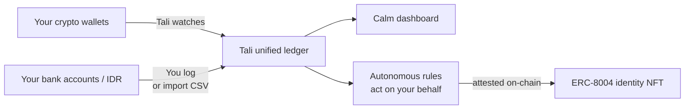

# Tali

> Threads your scattered money — onchain and offchain — into one calm screen, with an agent that acts on rules you set.

Built for the **Mantle Turing Test Hackathon 2026** (Phase 2 "AI Awakening"). Submission deadline: **2026-06-15 15:59**.

## What it does

Tali is a unified money tool for people who hold crypto across multiple wallets and bank accounts. It does three things that no existing product does together:

1. **Sees everywhere your money lives.** Onchain wallets (Mantle, plus read-only watch of MetaMask / Phantom / exchange balances) + offchain accounts (BCA, GoPay, manual cash) — one screen, total net worth in your currency.
2. **Threads P2P trades back together.** When you sell USDT for IDR via P2P, the trail vanishes from your bank statement. Tali lets you log it once in plain language — *"sold 2000 USDT, got 35.38M IDR"* — and links both sides as one event.
3. **Acts on rules you set.** Tell it once: *"whenever USDT comes into my wallet, save 10% as USDY."* Tali watches your wallet, executes the swap on Mantle when triggered, and attests each action under its own on-chain identity (ERC-8004).

## Built on

- **RealClaw** (OpenClaw-based agent framework with Telegram + Privy)
- **Mantle** (EVM L2 — custom `AutonomousRule.sol` + ERC-8004 NFT contracts)
- **Ondo USDY** (tokenized US Treasuries, the autonomous savings target)
- **Goldsky Mirror** (push-based real-time event delivery)
- **Alchemy** (RPC for state reads + tx submission)
- **Privy** (non-custodial split-key wallets)
- **Anthropic Claude** (natural-language intent parsing + screenshot OCR)

## Status

Locked spec: see `../context/13_project_locked.md`. Detailed architecture: `docs/architecture.md`. Workflow: `docs/workflow.md`. Roadmap: `docs/objectives.md`.

## Track positioning

- **Primary:** Agentic Economy Path B (RealClaw Real-Life Expansion)
- **Stretch:** AI×RWA + Grand Champion
- **Locked-in:** 20 Project Deployment Award

## License

TBD — will be open-source by submission per hackathon requirements.

## One-line pitch

*An AI agent that watches your crypto wallets and your bank accounts, threads them into one ledger, and acts on simple rules you set — all signed by its own on-chain identity.*
