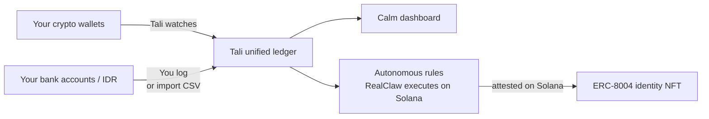

# Tali

> Your money, stitched together — onchain and off — with an agent that acts, and data only you can unlock.

Built for the **Mantle Turing Test Hackathon 2026** (Phase 2 "AI Awakening"). Submission deadline: **2026-06-15 15:59**.

## One-line pitch

*An autonomous financial agent for Southeast Asian users who live across two financial systems: Indonesian bank accounts and onchain crypto wallets — unified, reconciled, and acting on rules you set.*

## The three problems Tali solves

### 1. The Visibility Problem
No single tool shows an Indonesian crypto-native user their complete financial picture. Bank apps show IDR. Wallet explorers show onchain. Nothing connects them.

Tali solves this with a unified ledger: onchain wallets (Solana + read-only watch of MetaMask / Phantom / exchange balances) + offchain accounts (BCA, GoPay, manual cash) — one screen, real net worth in IDR.

### 2. The P2P Reconciliation Problem
When you sell USDT for IDR via P2P exchange, two things happen:
- USDT leaves your onchain wallet
- IDR appears in your bank account 20–30 minutes later

No tool on earth links these two events. The trail vanishes. Tali lets you log it once in plain language — *"sold 2000 USDT, got 35.38M IDR"* — and links both sides as a single reconciled event. This is Tali's most original feature and sharpest point of differentiation from any competitor.

### 3. The Agency Problem
Tracking is passive. Tali is active.

Set a rule: *"whenever USDT comes into my wallet, save 10% as USDY."* Tali watches your wallet continuously via Goldsky webhooks, executes the swap on Solana via RealClaw when triggered, and attests each action under its own on-chain identity (ERC-8004 NFT). Every autonomous action is signed, verifiable, and permanent — not stored in a SaaS database that can disappear.

## Current status

### Built — week 1
- Telegram bot: `/start` and `/networth` live
- Goldsky HMAC-verified webhook handler receiving real-time onchain events
- Unified event ledger schema (`users`, `events`, `watchedWallets`) via Drizzle ORM
- Privy server SDK: wallet creation and tx signing
- Price feeds via CoinGecko with IDR conversion
- Token registry for Solana

### Planned — week 2+
- `/log` — P2P reconciliation command (stub)
- `/rules` — autonomous rules engine (stub)
- `AutonomousRule.sol` + ERC-8004 NFT contracts (Foundry, Solana)
- RealClaw integration (trigger strategies, poll status, receive events)
- Web dashboard (Next.js)
- Self-sovereign encrypted storage (Arweave/IPFS/Filecoin)

## Built on

- **RealClaw** (OpenClaw-based agent framework with Telegram + Privy — the automation engine in this branch)
- **Solana** (primary chain — `AutonomousRule.sol` + ERC-8004 NFT contracts)
- **Ondo USDY** (tokenized US Treasuries, autonomous savings target)
- **Goldsky Mirror** (push-based real-time event delivery, HMAC-verified webhooks)
- **Alchemy** (RPC for state reads + tx submission)
- **Privy** (non-custodial split-key wallets, server SDK)
- **Anthropic Claude** (natural-language intent parsing + screenshot OCR)
- **viem** (chain interaction)
- **Drizzle ORM + PostgreSQL** (unified event ledger)
- **Hono** (webhook server)
- **Next.js** (web dashboard — week 2)

## Track positioning

- **Primary:** Agentic Economy Path B (RealClaw Real-Life Expansion)
- **Stretch:** AI×RWA + Grand Champion
- **Locked-in:** 20 Project Deployment Award

## Competitive position

Tali's moat, in priority order:
1. **P2P trade reconciliation** — no existing tool models this problem, let alone solves it
2. **Agentic rules engine** — moves real money autonomously via RealClaw, attested onchain via ERC-8004
3. **SEA-first, Indonesia-first** — structural advantage while Western tools explicitly exclude this market
4. **Data sovereignty** — self-sovereign encrypted storage; the Mint-proof guarantee no traditional fintech can offer
5. **ERC-8004 on-chain agent identity** — every autonomous action is publicly verifiable, not stored in a private SaaS database

## Data sovereignty (planned)

Tali will offer an opt-in self-sovereign mode: user financial data encrypted with the user's own private key, stored permanently on Arweave/IPFS/Filecoin. Tali cannot read it. If Tali shuts down tomorrow, the user's complete financial history remains accessible via their private key.

*"Your data, encrypted with your key, stored permanently. Tali could disappear tomorrow and you'd still have everything."*

The direct answer to the Mint shutdown problem — users who lost years of financial history when Mint closed in 2024.

## Docs

- Architecture: `docs/architecture.md`
- Workflow flows: `docs/workflow.md`
- Roadmap: `docs/objectives.md`

## License

TBD — will be open-source by submission per hackathon requirements.
