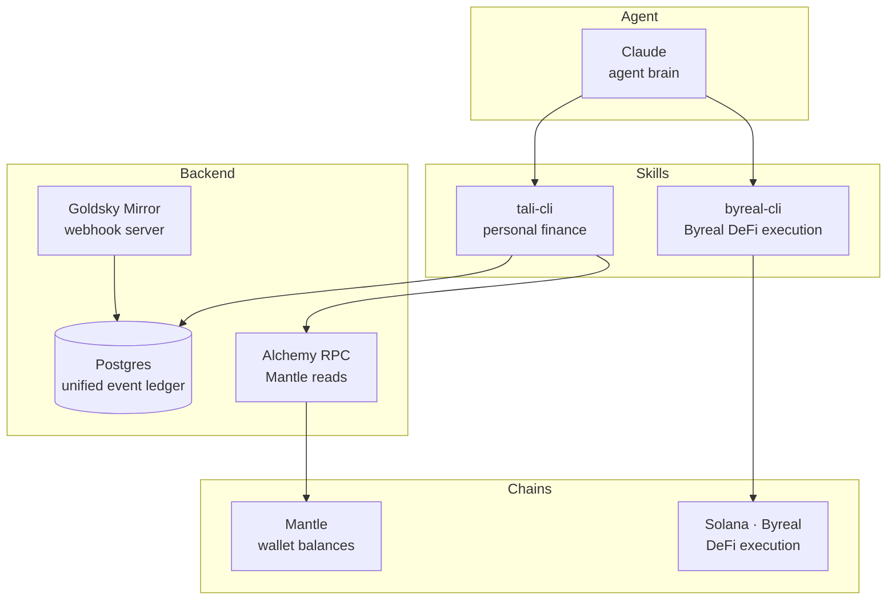

# Architecture

## What Tali is

Two OpenClaw skills + one Claude agent brain:

- **`tali-cli`** — personal finance layer (IDR net worth, unified ledger)
- **`byreal-cli`** — DeFi execution on Byreal/Solana (yield, DCA, swaps, positions)
- **Goldsky webhook server** — receives real-time onchain events, writes to Postgres

## Component map

## Wallet model

| Tier | What | Tali's access |
|---|---|---|
| Watched | MetaMask, Phantom, Indodax | Read-only via public address |
| Tali wallet | Privy embedded, Mantle | User-signed only |
| Byreal wallet | `byreal-cli` keypair at `~/.config/byreal/keys/` | Signs Solana txs locally |

## Why we dropped RealClaw and the Telegram bot

RealClaw has no external API — it works by taking over a bot token's Telegram webhook. There is no programmatic bridge from Tali's server to RealClaw. `byreal-cli` is the correct integration point: it calls `api2.byreal.io` directly and signs transactions locally. The Telegram bot was removed because the OpenClaw skill interface replaces it.

## Component responsibilities

| Component | Owns | Never does |
|---|---|---|
| `tali-cli` | Net worth, ledger reads/writes | DeFi execution |
| `byreal-cli` | DeFi execution on Byreal/Solana | Personal finance data |
| Goldsky Mirror | Real-time event delivery | On-demand state reads |
| Alchemy RPC | Mantle balance reads | Event watching |
| Privy | Mantle wallet keys (split-key) | Make decisions autonomously |
| Postgres | Offchain event ledger | On-chain canonical truth |
