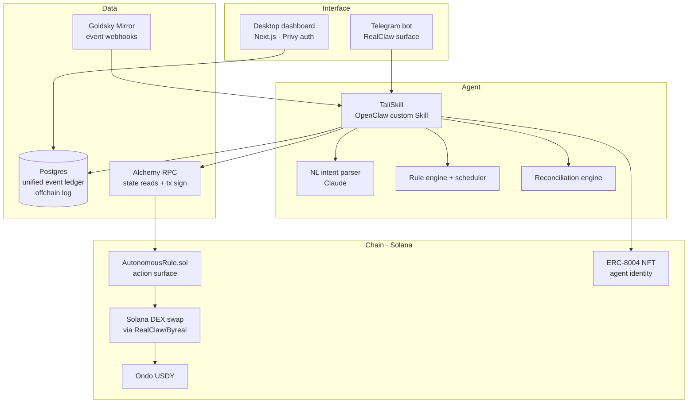
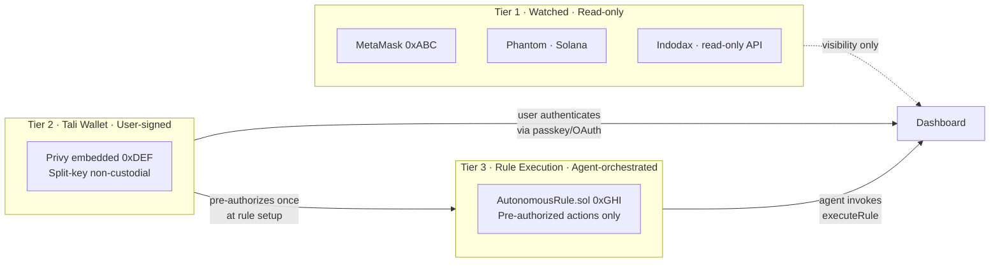
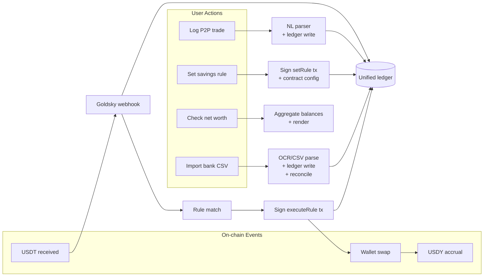

# Architecture

High-level view of how Tali's components fit together. Source-of-truth product spec lives at `../../context/13_project_locked.md`.

## Layered view

## The three-tier wallet model

This is the single most important honesty for users — what Tali can read vs sign vs auto-execute.

**Reading the diagram:**
- **Tier 1** wallets are visible to Tali but Tali has no signing authority. Like Etherscan, but for your unified picture.
- **Tier 2** is the new wallet Privy creates for you. You authenticate each manual send. Actions execute on Solana via RealClaw/Byreal.
- **Tier 3** is the smart contract where rules execute. User pre-authorizes once at rule setup; agent invokes `executeRule()` thereafter within the rule's scope.

Full security and failure-mode discussion: `../../context/13_project_locked.md` "Wallet model" section.

## Component responsibilities

| Component | What it owns | What it never does |
|---|---|---|
| **Telegram bot (RealClaw)** | User-facing chat surface, NL input, notifications | Sign transactions directly (delegates to Privy); store secrets |
| **TaliSkill (OpenClaw Skill)** | Rule engine, reconciliation, ledger writes, agent decisions | Hold keys; bypass user authorization |
| **Goldsky Mirror** | Real-time event delivery via webhooks, re-org handling, retry | Read state on demand (that's RPC's job) |
| **Alchemy RPC** | Balance queries, transaction submission via Privy, fallback reads | Watch events (Goldsky's job) |
| **Privy** | Non-custodial wallet keys (split between secure enclave + user auth) | Make decisions; act without explicit user/contract auth |
| **AutonomousRule.sol** | Storing rule configs on-chain, executing constrained actions, emitting attestations | Hold rule logic; act without agent invocation |
| **ERC-8004 NFT** | Agent identity, action attestation log, public reputation surface | Hold funds; control wallet authority |
| **Postgres** | Offchain log, unified event ledger, user state | Hold authoritative on-chain truth (chain is canonical) |
| **Next.js dashboard** | Calm daily-use surface, activity feed, net-worth screen | Mutate state (calls TaliSkill API for writes) |

## Data flow at a glance

## Why this shape

The key architectural decision is **Pattern B: agent-orchestrated action**. We picked it over Pattern A (contract self-executes) because:

1. The agent doing the reasoning is what makes this on-thesis for "agent autonomy" scoring
2. Rule logic in TypeScript is faster to iterate than rule logic in Solidity
3. Complex rule conditions (multi-trigger, time-aware, cross-asset) are agent territory, not contract territory
4. Smart contract stays minimal — just a constrained action surface the agent can invoke

The contract has authority bounded by what the user signed for. The agent has the reasoning. Together they form an autonomous loop without custodial trust.

Full Pattern A vs B reasoning: `../../context/13_project_locked.md` "Tier 3 — AutonomousRule.sol" section.

## Data sovereignty (planned — week 2+)

Tali will offer an opt-in self-sovereign mode for user financial data:

- **Default:** data stored on Tali's server (Drizzle ORM + PostgreSQL)
- **Self-sovereign mode (planned):** user data encrypted client-side with the user's own private key, stored permanently on Arweave/IPFS/Filecoin. Tali cannot read it. If Tali shuts down, the user's complete financial history remains accessible via their private key.

**Important:** this is never transparent-by-default onchain storage. Financial data is never written to a public blockchain in readable form. Always encrypted client-side before storage. The onchain layer is a neutral carrier.

User-facing framing: *"Your data, encrypted with your key, stored permanently. Tali could disappear tomorrow and you'd still have everything."*

This is the direct answer to the Mint shutdown problem (2024). See `idea-bank/later/data-sovereignty.md` for full concept.

## See also

- [`workflow.md`](workflow.md) — step-by-step user flows (onboarding, rule firing, P2P trade logging, monthly bank import)
- [`objectives.md`](objectives.md) — 3-week roadmap, MVP scope, what we won't build
