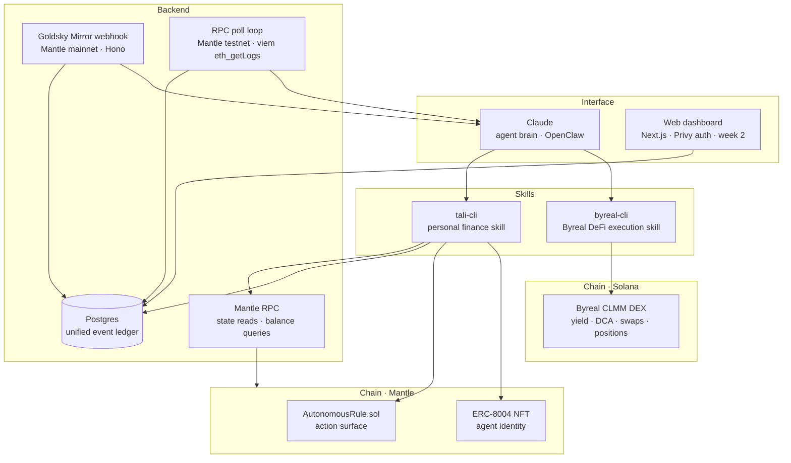
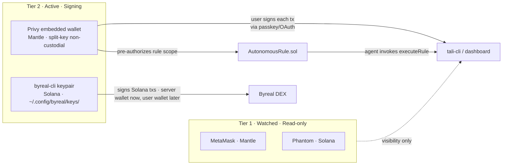
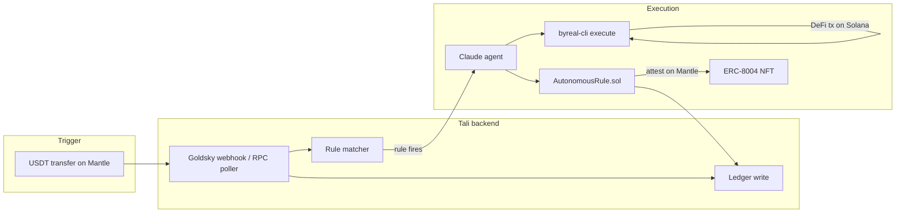

# Architecture

## Why we dropped RealClaw and the Telegram bot

RealClaw has no external API — it works by taking over a bot token's Telegram webhook. There is no programmatic bridge from Tali's server to RealClaw. `byreal-cli` is the correct integration point: it calls `https://api2.byreal.io` directly and signs Solana transactions locally. The Telegram bot was removed because the OpenClaw skill interface replaces it.

---

## Layered view



---

## Chain separation: Mantle vs Solana

Tali spans two chains with a clean division — you never cross the boundary in code.

| | Mantle | Solana |
|---|---|---|
| **Purpose** | "Bank account" layer — balances, rules, identity | "DeFi execution" layer — yield, DCA, swaps |
| **What lives here** | Watched wallets, MNT/USDT balances, `AutonomousRule.sol`, ERC-8004 NFT | Byreal CLMM positions, LP tokens |
| **Who reads it** | `tali-cli` via any Mantle RPC URL (Alchemy, Chainstack, public, etc.) | `byreal-cli` — internally managed, you don't wire it |
| **Who writes to it** | Privy wallet (user-signed), `AutonomousRule.sol` | `byreal-cli` keypair (`~/.config/byreal/keys/`) |
| **Real-time events** | **Mainnet:** Goldsky Mirror webhook pushes ERC-20 Transfer events. **Testnet:** RPC poll loop (`eth_getLogs`, Mantle Sepolia, viem) for local dev — zero per-delivery cost. Both write to the same `onchain_events` table. | Not needed — byreal-cli polls its own state |
| **What you need to set up** | `MANTLE_ALCHEMY_RPC` (mainnet) + `MANTLE_PUBLIC_RPC` (testnet, optional) | Run `byreal-cli setup` — it handles everything |

> **Why two ingestion paths:** Goldsky Mirror only covers Mantle mainnet. For testnet development, `eth_getLogs` polling against the public Mantle Sepolia RPC is free and needs no external account. QuickNode was ruled out due to per-payload credit cost on testnet iteration. The `source` column in `onchain_events` (`goldsky_mirror` vs `rpc_poll`) distinguishes origin.

**Key rule:** Solana execution is fully encapsulated in `byreal-cli`. Tali's backend never imports a Solana library or holds a Solana RPC URL. If you need Solana state, ask `byreal-cli`.

---

## Two-tier wallet model



**Reading the diagram:**
- **Tier 1** wallets are visible to Tali but Tali has no signing authority.
- **Privy** wallet handles Mantle — user signs manually or pre-authorizes a rule scope once.
- **byreal-cli keypair** handles Solana DeFi. Currently: dedicated server agent wallet at `~/.config/byreal/keys/` on the backend server (Option 2). Production target: user's own wallet via local OpenClaw execution (Option 1 — see § "Execution model").

---

## Data flow: rule firing



---

## Execution model: current vs. production

### Option 2 — Server-side byreal-cli (hackathon implementation)

`byreal-cli` is installed on the Tali backend server. When a rule fires, the server spawns it as a child process directly.

```
Goldsky webhook / RPC poller → Rule matcher → Claude planner → ExecutionGateway
                                                        ↓
                                              ByreaCliExecutor
                                              execSync('byreal-cli ...')
                                              server agent wallet
                                              (~/.config/byreal/keys/)
```

**Wallet isolation:** `byreal-cli` manages its own Solana keypair at `~/.config/byreal/keys/`. This directory is owned by the process user and is never accessed by the Hono webhook handler. The server runs a **dedicated agent wallet** (not the user's Phantom wallet) that is pre-funded for automated execution.

**Code seam:** `backend/src/agent/executor.ts` — `ExecutionGateway` interface. Only `ByreaCliExecutor` is wired in production today. Swapping to Option 1 is a single implementation change behind this interface; all rule matching, Claude planning, and Mantle attestation code is unchanged.

---

### Option 1 — Push notification (production target, not yet implemented)

When a rule fires, the server sends a push notification to the user's device. The user confirms; their local OpenClaw instance executes `byreal-cli` with **their own Phantom-connected wallet**. The server receives the result via a signed callback and attests on Mantle.

```
Goldsky webhook / RPC poller → Rule matcher → Claude planner → ExecutionGateway
                                                        ↓
                                              PushNotificationExecutor   (not built)
                                              → push to user device
                                              → user confirms in OpenClaw
                                              → local byreal-cli executes
                                              → signed callback to server
```

**Why this is better long-term:**
- User's own wallet signs Solana txs — no server-side key risk
- byreal-cli uses user's full Byreal account state (positions, history)
- Matches OpenClaw's intended local-execution model

**Migration:** Implement `PushNotificationExecutor implements ExecutionGateway` in `backend/src/agent/executor.ts` and swap the factory in `createExecutor()`. No other files change.

---

## Component responsibilities

| Component | Owns | Never does |
|---|---|---|
| **Claude (agent brain)** | Reasoning, NL parsing, orchestrating skills | Sign transactions; store secrets |
| **tali-cli** | Net worth, ledger writes, rule management, Mantle interactions | DeFi execution |
| **byreal-cli** | DeFi execution on Byreal/Solana — yield, DCA, swaps, positions | Personal finance data |
| **Goldsky Mirror** | Real-time ERC-20 Transfer events → webhook server (Mantle mainnet) | On-demand state reads |
| **RPC poll loop** | ERC-20 Transfer events via `eth_getLogs` (Mantle Sepolia testnet) | Mainnet event delivery |
| **Mantle RPC** | Balance reads, on-demand state | Event watching |
| **Privy** | Mantle wallet keys (split-key, non-custodial) | Make decisions autonomously |
| **AutonomousRule.sol** | Store rule configs on Mantle, emit attestations | Execute Solana DeFi |
| **ERC-8004 NFT** | Agent identity, action log, public reputation on Mantle | Hold funds |
| **Postgres** | Offchain event ledger, user state | Authoritative on-chain truth |

---

## See also

- [`workflow.md`](workflow.md) — sequence diagrams for each major flow
- [`objectives.md`](objectives.md) — 3-week roadmap and submission gate
- [`intents.md`](intents.md) — NL intent contract between user input and skill layer
