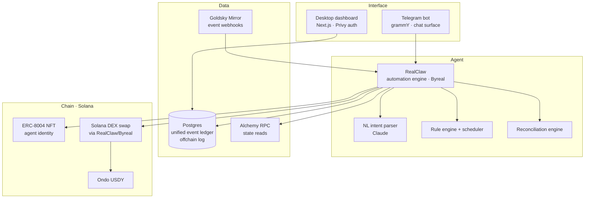
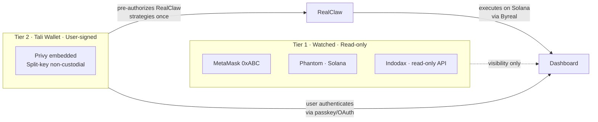
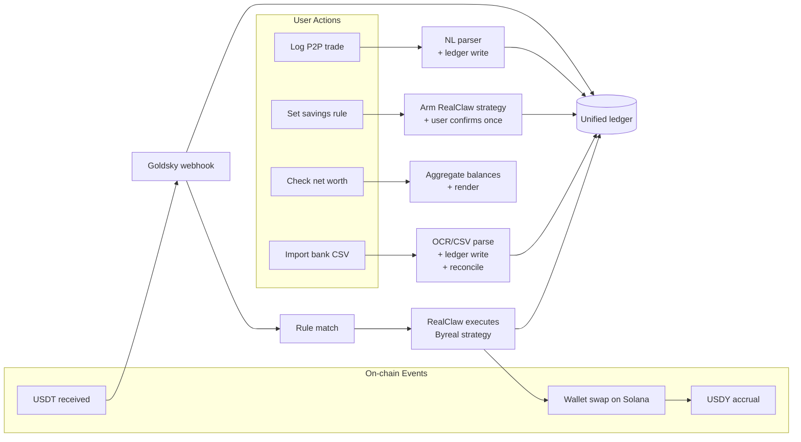

# Architecture

High-level view of how Tali's components fit together.

## Layered view

## The two-tier wallet model

In this branch, AutonomousRule.sol is not used — RealClaw handles pre-authorized automation natively. The wallet model simplifies to two tiers.

**Reading the diagram:**
- **Tier 1** wallets are visible to Tali but Tali has no signing authority. Like Etherscan, but for your unified picture.
- **Tier 2** is the wallet Privy creates for you. You authenticate each manual send. Actions execute on Solana via RealClaw/Byreal.

## Component responsibilities

| Component | What it owns | What it never does |
|---|---|---|
| **Telegram bot (grammY)** | User-facing chat surface, NL input, push notifications | Sign transactions directly (delegates to RealClaw/Privy); store secrets |
| **RealClaw** | DeFi automation engine — yield, DCA, swaps via Byreal on Solana; rule execution | Hold personal finance data (that's Tali's job) |
| **Tali backend** | Personal finance data layer — unified ledger, IDR net worth, P2P log, bank import, reconciliation | Execute DeFi actions directly (delegates to RealClaw) |
| **Goldsky Mirror** | Real-time event delivery via webhooks, re-org handling, retry | Read state on demand (that's RPC's job) |
| **Alchemy RPC** | Balance queries, read state on demand | Watch events (Goldsky's job); sign transactions (Privy's job) |
| **Privy** | Non-custodial wallet keys (split between secure enclave + user auth) | Make decisions; act without explicit user/contract auth |
| **ERC-8004 NFT** | Agent identity, action attestation log, public reputation surface | Hold funds; control wallet authority |
| **Postgres** | Offchain log, unified event ledger, user state | Hold authoritative on-chain truth (chain is canonical) |
| **Next.js dashboard** | Calm daily-use surface, activity feed, net-worth screen | Mutate state (calls Tali backend API for writes) |

## Data flow at a glance

## Why this shape

**Pattern B: agent-orchestrated action.** RealClaw is the agent; Tali provides the personal finance context that makes it useful beyond DeFi. Key reasons:

1. RealClaw already has pre-authorized autonomous execution — no custom contract needed
2. Byreal primitives (Kamino yield, CLMM, DCA) are richer than anything we could build in the hackathon timeline
3. Tali's value add is the data layer: P2P reconciliation, bank imports, IDR net worth — things RealClaw doesn't have
4. The integration demonstrates genuine RealClaw Real-Life Expansion, which is the scoring criterion

## Data sovereignty (planned — week 2+)

Tali will offer an opt-in self-sovereign mode for user financial data:

- **Default:** data stored on Tali's server (Drizzle ORM + PostgreSQL)
- **Self-sovereign mode (planned):** user data encrypted client-side with the user's own private key, stored permanently on Arweave/IPFS/Filecoin. Tali cannot read it. If Tali shuts down, the user's complete financial history remains accessible via their private key.

**Important:** this is never transparent-by-default onchain storage. Financial data is never written to a public blockchain in readable form. Always encrypted client-side before storage. The onchain layer is a neutral carrier.

User-facing framing: *"Your data, encrypted with your key, stored permanently. Tali could disappear tomorrow and you'd still have everything."*

This is the direct answer to the Mint shutdown problem (2024). See `idea-bank/later/data-sovereignty.md` for full concept.

## See also

- [`workflow.md`](workflow.md) — step-by-step user flows
- [`objectives.md`](objectives.md) — 3-week roadmap, MVP scope, what we won't build
