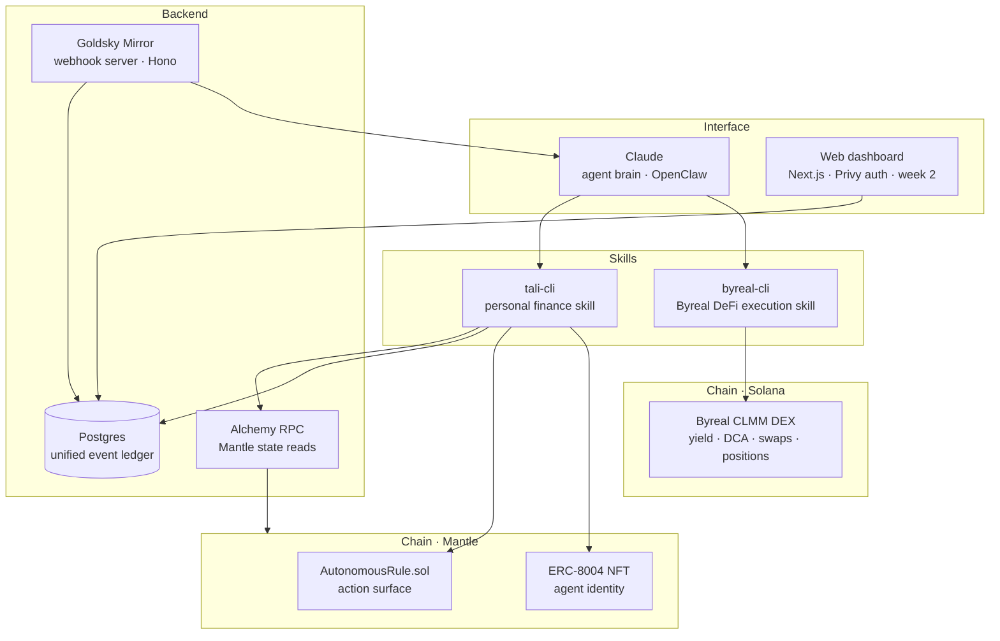
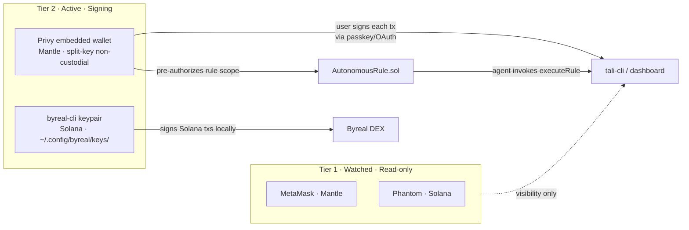
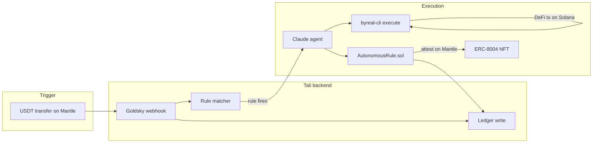

# Architecture

## Why we dropped RealClaw and the Telegram bot

RealClaw has no external API — it works by taking over a bot token's Telegram webhook. There is no programmatic bridge from Tali's server to RealClaw. `byreal-cli` is the correct integration point: it calls `https://api2.byreal.io` directly and signs Solana transactions locally. The Telegram bot was removed because the OpenClaw skill interface replaces it.

---

## Layered view

---

## Two-tier wallet model

**Reading the diagram:**
- **Tier 1** wallets are visible to Tali but Tali has no signing authority.
- **Privy** wallet handles Mantle — user signs manually or pre-authorizes a rule scope once.
- **byreal-cli keypair** handles Solana DeFi — local signing, never transmitted.

---

## Data flow: rule firing

---

## Component responsibilities

| Component | Owns | Never does |
|---|---|---|
| **Claude (agent brain)** | Reasoning, NL parsing, orchestrating skills | Sign transactions; store secrets |
| **tali-cli** | Net worth, ledger writes, rule management, Mantle interactions | DeFi execution |
| **byreal-cli** | DeFi execution on Byreal/Solana — yield, DCA, swaps, positions | Personal finance data |
| **Goldsky Mirror** | Real-time event delivery via webhooks, re-org handling | On-demand state reads |
| **Alchemy RPC** | Mantle balance reads, on-demand state | Event watching |
| **Privy** | Mantle wallet keys (split-key, non-custodial) | Make decisions autonomously |
| **AutonomousRule.sol** | Store rule configs on Mantle, emit attestations | Execute Solana DeFi |
| **ERC-8004 NFT** | Agent identity, action log, public reputation on Mantle | Hold funds |
| **Postgres** | Offchain event ledger, user state | Authoritative on-chain truth |

---

## See also

- [`workflow.md`](workflow.md) — sequence diagrams for each major flow
- [`objectives.md`](objectives.md) — 3-week roadmap and submission gate
- [`intents.md`](intents.md) — NL intent contract between user input and skill layer
