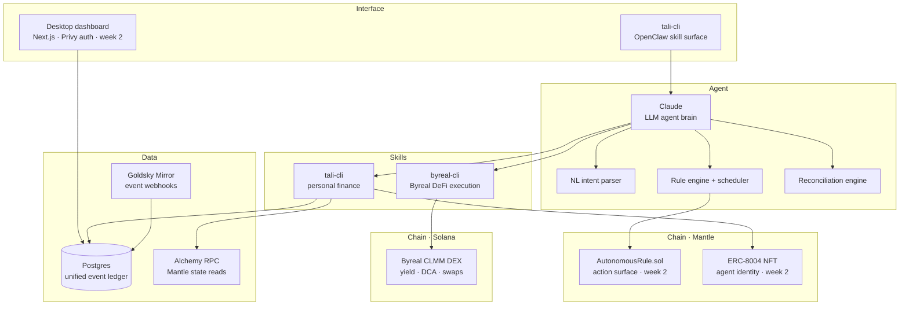
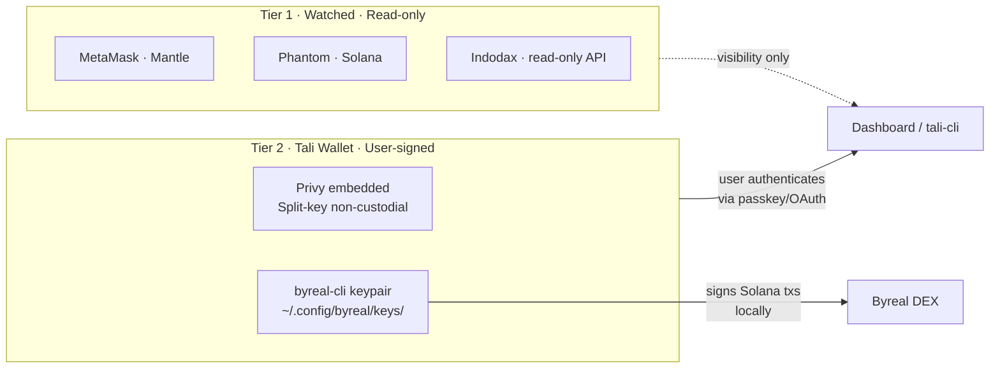
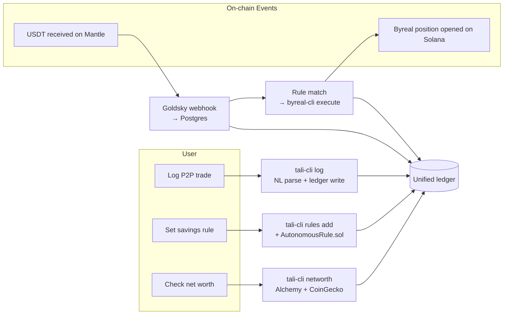

# Architecture

## Architectural decision record: why we dropped RealClaw and the Telegram bot

**The logical error (documented 2026-05-29):**

The original design assumed Tali's server could call RealClaw to trigger DeFi strategies. This was wrong for two reasons:

1. **RealClaw has no external API.** There is no REST endpoint, webhook, or SDK for triggering RealClaw strategies programmatically. RealClaw's only interface is natural language messages sent via Telegram.
2. **One bot token, one webhook.** Registering a bot token with RealClaw means RealClaw sets a webhook on that bot. Tali's grammY server cannot also hold a webhook on the same token. The two would fight.

**The correct model:**
- Tali uses `byreal-cli` directly — the underlying execution CLI that RealClaw itself is built on top of.
- `byreal-cli` calls `https://api2.byreal.io` REST API and signs Solana transactions locally.
- Tali's `tali-cli` is an OpenClaw skill for personal finance, published alongside `byreal-cli`.
- Claude (the LLM) is the agent brain, using both skills as tools.
- No Telegram bot. No RealClaw.

---

## Layered view

## Two-tier wallet model

**Reading the diagram:**
- **Tier 1** wallets are visible to Tali but Tali has no signing authority.
- **Tier 2** has two sub-wallets: Privy for Mantle (user-signed), and `byreal-cli`'s local keypair for Solana DeFi execution.

## Component responsibilities

| Component | What it owns | What it never does |
|---|---|---|
| **tali-cli (OpenClaw Skill)** | Net worth, P2P reconciliation, ledger writes, rule management | Execute DeFi trades (delegates to byreal-cli) |
| **byreal-cli (Byreal Agent Skills)** | DeFi execution on Byreal/Solana — yield, DCA, swaps, positions | Hold personal finance data (that's Tali's job) |
| **Claude (LLM)** | Agent reasoning, NL parsing, orchestrating both skills | Sign transactions; store secrets |
| **Goldsky Mirror** | Real-time event delivery via webhooks, re-org handling, retry | Read state on demand (that's RPC's job) |
| **Alchemy RPC** | Mantle balance queries, read state on demand | Watch events (Goldsky's job) |
| **Privy** | Non-custodial Mantle wallet keys (split-key) | Make decisions; act without explicit user auth |
| **AutonomousRule.sol** | Storing rule configs on Mantle, emitting attestations | Execute Solana DeFi (that's byreal-cli's job) |
| **ERC-8004 NFT** | Agent identity, action attestation log, public reputation on Mantle | Hold funds; control wallet authority |
| **Postgres** | Offchain log, unified event ledger, user state | Hold authoritative on-chain truth |

## Data flow at a glance

## Why this shape

**Two-skill model instead of monolith.** Byreal already has a production-grade DeFi execution CLI. Building Solana DEX interaction from scratch in the hackathon timeline would be inferior and risky. Tali's value-add is the personal finance layer — reconciliation, IDR visibility, bank import — which Byreal doesn't have. Both skills together form a complete autonomous financial agent.

**Mantle for attestation, Solana for execution.** The hackathon runs on Mantle. ERC-8004 NFT and `AutonomousRule.sol` live on Mantle — on-chain record of every agent decision. Actual DeFi execution is on Byreal/Solana where the liquidity lives.

**OpenClaw as the interface.** Publishing as an OpenClaw skill means any LLM that supports OpenClaw can install and use Tali. Claude Code, RealClaw, and future agents all become first-class users.

## See also

- [`workflow.md`](workflow.md) — step-by-step user flows
- [`objectives.md`](objectives.md) — 3-week roadmap, MVP scope
