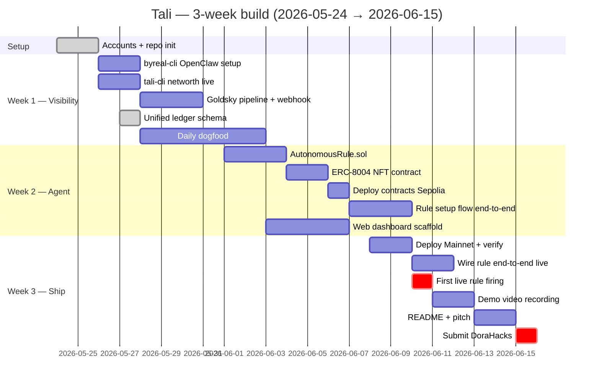
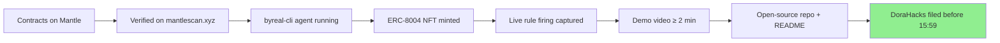

# Objectives & roadmap

What we're shipping, when, and why. Single source of truth for scope decisions.

---

## North star

**Mufidah opens Tali every day, and her financial life makes more sense because of it.**

If that's not true by 2026-06-15, nothing else matters.

---

## Three-week roadmap

---

## MVP scope

### Week 1 — Visibility

- `byreal-cli` OpenClaw agent running DeFi on Byreal/Solana
- `tali-cli networth` live with real API keys
- Goldsky webhook server receiving Mantle transfer events

### Week 2 — Agent

- `AutonomousRule.sol` + ERC-8004 NFT deployed on Mantle Sepolia
- Rule setup flow: NL → Privy signature → contract
- Goldsky event → byreal-cli execution → Mantle attestation
- Web dashboard scaffold on Vercel

### Week 3 — Ship

- Contracts live on Mantle Mainnet, verified on mantlescan.xyz
- At least one live rule firing on record
- Demo video ≥ 2 min
- DoraHacks submitted

---

## Submission gate (all must be ✅)

---

## Competitive moat

1. **Autonomous agent with real on-chain identity** — ERC-8004 NFT on Mantle records every action. Not stored in a SaaS database.
2. **Real DeFi execution** — `byreal-cli` runs production Byreal/Solana strategies, not a demo. Genuine value created.
3. **Personal finance layer** — IDR net worth across Mantle wallets. No other DeFi agent speaks IDR or understands Southeast Asian users.
4. **Agentic Economy Path B** — Tali extends Byreal into real-life financial management. The demo story is: *set a rule once, agent acts while you sleep, every action verifiable onchain.*
5. **P2P trade reconciliation** — future differentiator in `idea-bank/next-month/`. No competing tool models this problem.

---

## Decision principles

1. **Ship > perfect.** One working autonomous rule beats three half-finished ones.
2. **Honest scope > overclaiming.** Under-promise, over-deliver.
3. **No pivots until 2026-06-15.** New ideas → `idea-bank/`, not active scope.
4. **Mufidah's daily-use happiness > judges' applause.**
