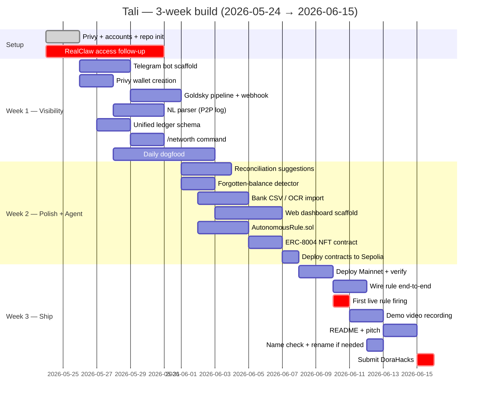
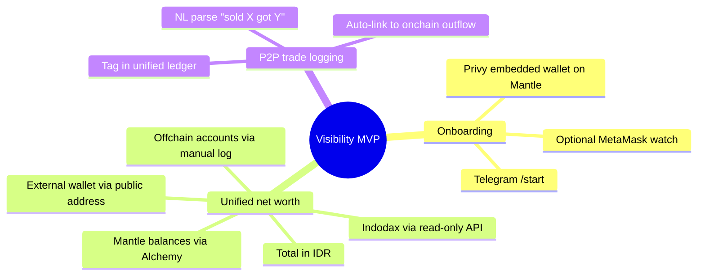
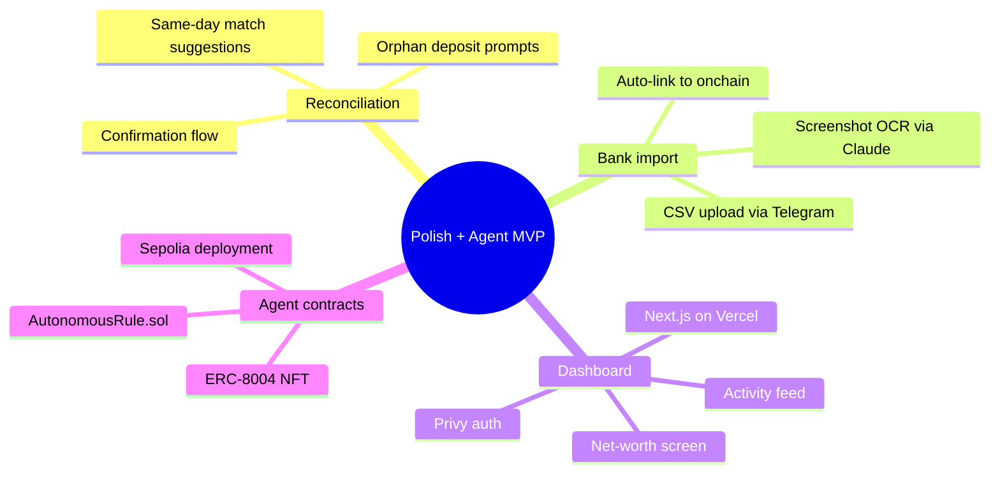
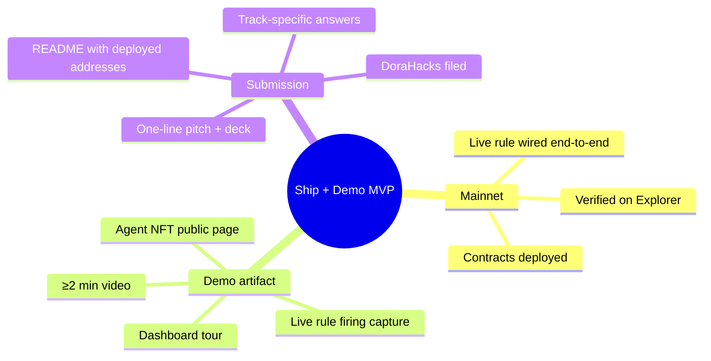
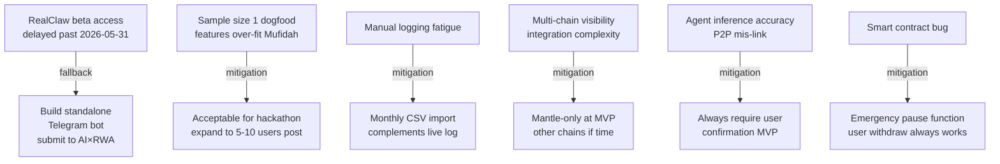

# Objectives & roadmap

What we're shipping, when, and why. Single source of truth for scope decisions during the build.

---

## North star

**Mufidah opens Tali every day, and her financial life makes more sense because of it.**

If that's not true by 2026-06-15, nothing else matters.

---

## Three-week roadmap

---

## MVP scope (what ships by 2026-06-15)

### Visibility (week 1)

### Polish + agent foundation (week 2)

### Ship + demo (week 3)

---

## Out of scope (deliberately not building for MVP)

- Multi-user / families / shared accounts (was TKI's territory)
- Tax filing automation (downstream of reconciliation — v2)
- Trading / portfolio strategies (we're not a trader's tool)
- Custodial features (everything user-held via Privy)
- Bank-connect auto-sync via Brick API (v2 — removes daily logging fatigue)
- Multi-chain action (Mantle-only at MVP; watch other EVM read-only if time permits)
- Beneficiary / dead-man switch (Kubera-borrow for v2)
- Multiple rules per user (single rule at MVP; multi-rule library is v1.5)
- ERC-4337 session keys (Option B pre-authorized contract at MVP; session keys v2)

---

## Honest risks

Full risk discussion: `../../context/13_project_locked.md` "Honest known risks" section.

---

## Submission gate (everything below must be ✅ before submitting)

```mermaid
graph LR
    A[Contracts deployed<br/>Mantle] --> B[Verified on<br/>Mantle Explorer]
    B --> C[AI-callable<br/>on-chain function]
    C --> D[Public frontend<br/>accessible]
    D --> E[Deployment address<br/>in submission]
    E --> F[Demo video<br/>≥ 2 min]
    F --> G[Open-source repo<br/>+ README]
    G --> H[One-line pitch<br/>+ deck]
    H --> I[Track-specific<br/>answers prepared]
    I --> J[ERC-8004 NFT<br/>minted for Mufidah]
    J --> K[Submit DoraHacks<br/>before 15:59]
    style K fill:#90ee90
```

Working checklist with check-as-you-go status: `../../todo.md` "Submission checklist" section.

---

## Next-session queue (deferred from 2026-05-24 work session)

When the next work session begins (after `pnpm install` + Drizzle migrations + Telegram bot setup), the queued artifacts I should produce on request:

1. **Goldsky Mirror pipeline config** — YAML/dashboard steps for a Transfer-event indexer covering USDT, USDC, USDY, mETH on Mantle Mainnet, filtered to user wallet addresses, delivering to the `/webhooks/goldsky` endpoint with HMAC signing.
2. **Mantle Explorer token-address verification checklist** — exact addresses to confirm on mantlescan.xyz for USDT (bridged), USDC (bridged), mETH (Mantle staked ETH), USDY (Ondo). Currently `skill/src/lib/tokens.ts` has placeholders marked TODO.

Both are queued in `../../todo.md` "Next session pickup" section.

## Decision principles (resolve disputes against these)

1. **Mufidah's daily-use happiness > judges' applause.** If something polishes the demo but Mufidah wouldn't use it daily, deprioritize.
2. **Ship > perfect.** Better to have one working autonomous rule than three half-finished ones.
3. **Honest scope > overclaiming.** Better to under-promise in the pitch and over-deliver than vice versa.
4. **Clarity, calm, control** — the Kubera language register. Every UI surface and every notification.
5. **Pattern B agent-orchestrated** — when in doubt, the agent reasons, the contract executes.
6. **No more pivots until 2026-06-15.** New ideas go to `parking_lot.md`, not into active scope.

---

## After 2026-06-15

If Tali ships and Mufidah genuinely uses it daily, the v1.5 / v2 directions are sketched in `../../context/parking_lot.md`. Otherwise the lessons get written up and we move on. Either way, no decisions about post-hackathon scope during the hackathon.
