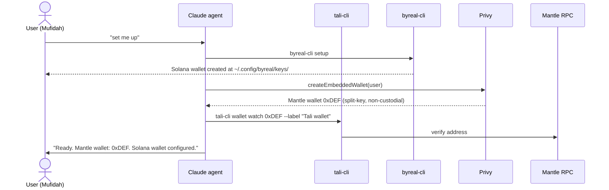
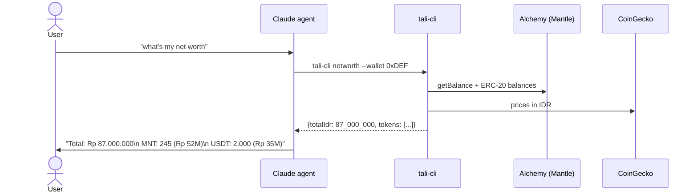
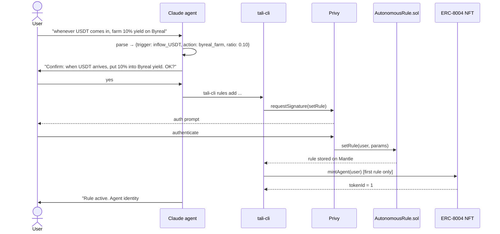
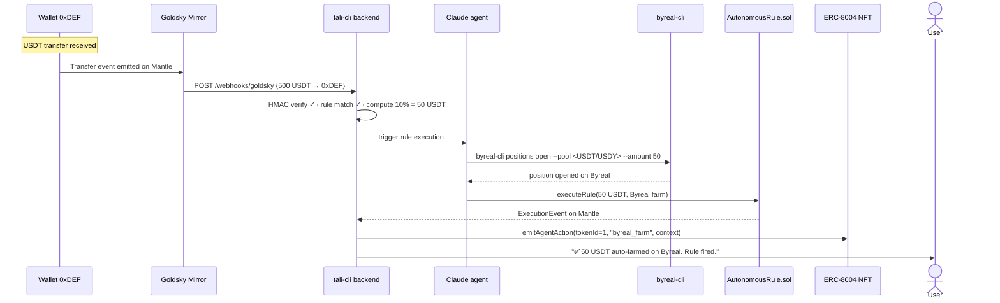
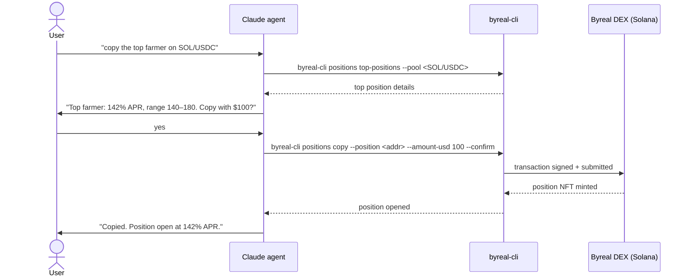
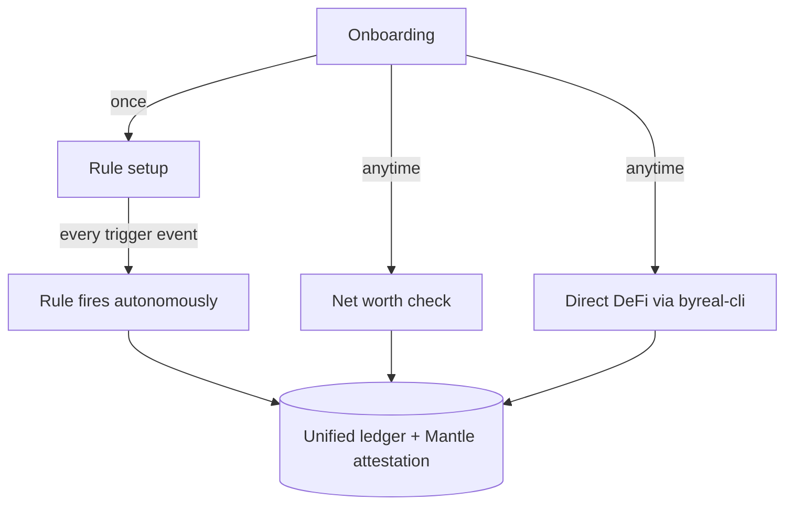

# Workflow

How users interact with Tali, end-to-end. Claude is the agent brain; `tali-cli` and `byreal-cli` are the skills.

---

## 1. Onboarding (first 10 min)

---

## 2. Checking net worth

---

## 3. Setting up an autonomous rule (the agent demo)

---

## 4. Rule firing autonomously (the demo moment)

**This is the 30-second screen-worthy moment.** Onchain event → agent reasons → DeFi executes → Mantle attests. Zero user interaction.

---

## 5. DeFi directly via byreal-cli

---

## How the flows connect

