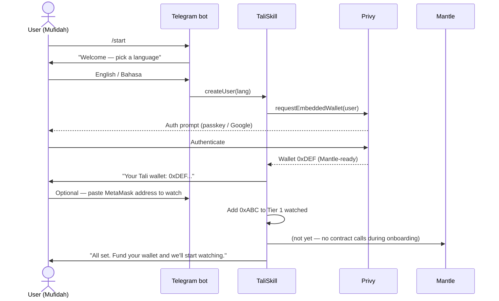
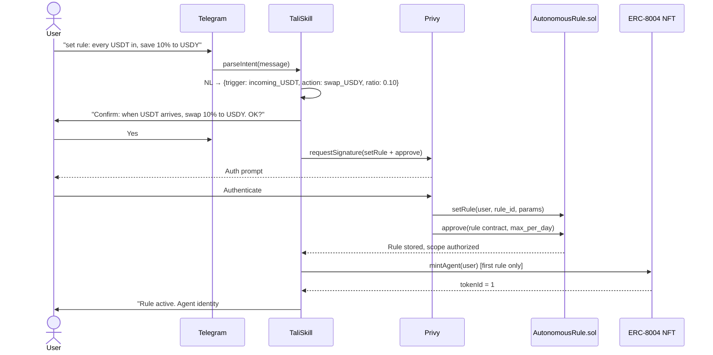
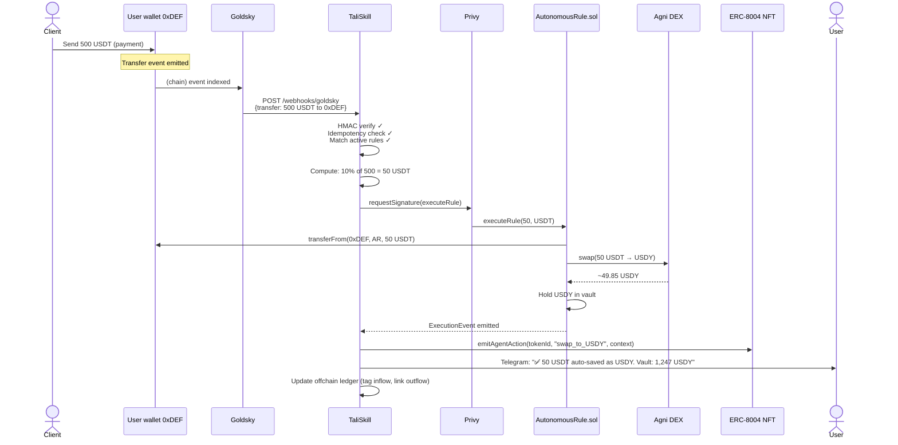
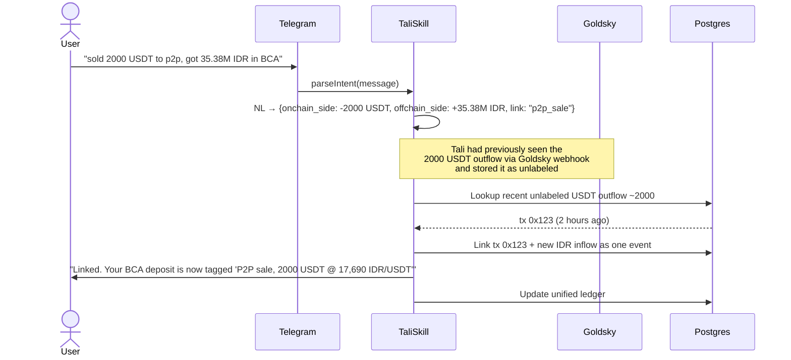
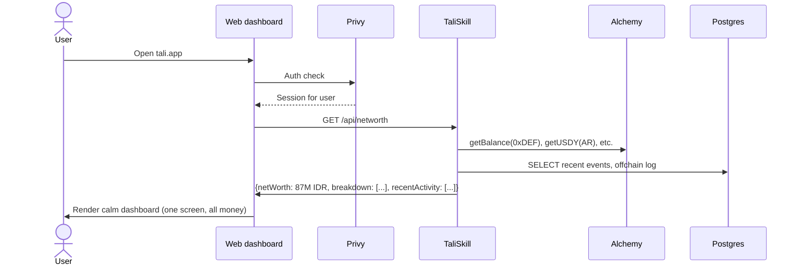
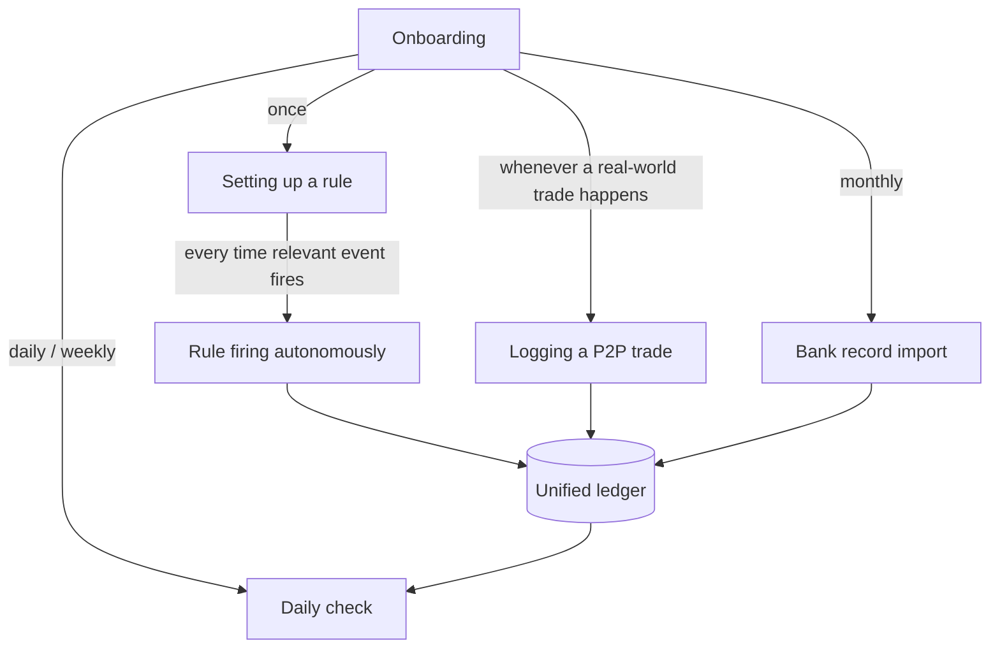

# Workflow

How users interact with Tali, end-to-end, with sequence diagrams for each major flow.

---

## 1. User onboarding (first 5 min)



**What's NOT happening here:**
- No ERC-8004 NFT minted yet (that happens at first rule activation)
- No `AutonomousRule.sol` deployed per user (it's a singleton on Mantle)
- No funds moved anywhere

**User feels:** *"That was easier than I expected. I have a wallet without a seed phrase."*

---

## 2. Setting up a rule (one-time, ~30 sec)



**Why one signature covers many future actions:** Option B (pre-authorized rule contract). The single `approve` call gives `AutonomousRule.sol` bounded authority to pull USDT from the user's wallet up to a daily limit. The agent invokes `executeRule()` thereafter without fresh user auth.

**User feels:** *"I told it once. Now it watches my back."*

---

## 3. Rule firing autonomously (the demo moment)

This is the 30-second screen-worthy moment for the hackathon live stream.



**RealClaw/TaliSkill is involved at every step except the chain mechanics.** That's where the agent earns its "agent autonomy" scoring.

**User feels:** *"It just happened. I didn't lift a finger. And there's a verifiable record of what my agent did."*

---

## 4. Logging a P2P trade (manual, real-time)

The killer reconciliation moment: USDT outflow + IDR inflow linked as one event.



**Why this matters:** that BCA deposit goes from "mystery transfer from random name" to "P2P sale, 2000 USDT at known rate" — automatically. Tax recon, mental clarity, and trust-with-family all benefit.

**User feels:** *"Finally. I don't have to remember what that 35M deposit was for."*

---

## 5. Monthly bank-record import (catch-up flow)

For everything you didn't log in real time, drop a CSV or screenshot once a month.

```mermaid
sequenceDiagram
    actor U as User
    participant TG as Telegram
    participant SK as TaliSkill
    participant CL as Claude vision API
    participant DB as Postgres

    U->>TG: [uploads BCA statement screenshot.jpg]
    TG->>SK: receive document
    SK->>CL: extract_transactions(image)
    CL-->>SK: [{date, amount, note}, ...]
    SK->>SK: For each entry, try to auto-link with onchain events
    SK->>DB: Bulk insert entries; mark some as linked, some as orphan
    SK->>U: "Imported 23 transactions. 18 auto-linked. 5 need your review:<br/>1. 1.2M IDR on May 15 — what was this?"
    U->>TG: "That was a friend paying me back"
    SK->>DB: Tag entry, learn pattern
```

**Complement to live logging:** real-time NL log captures intent at the moment; monthly import catches up the noise. Neither replaces the other — they merge in the same ledger.

---

## 6. Daily check (calm dashboard)



**User feels:** *"I know exactly where I stand. No anxiety, no five tabs open."*

---

## How the flows connect



Each flow writes to the same unified ledger. The dashboard is the read surface. The agent acts on triggers across all of them.
