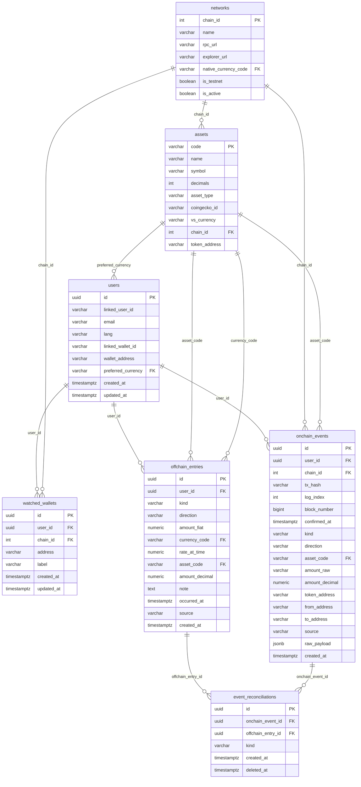

# refactor: Schema redesign + Goldsky webhook pivot

## Enhancement Summary

**Deepened:** 2026-05-31
**Research agents:** Drizzle best-practices, Goldsky integration, financial data modeling, security, data integrity, architecture, TypeScript quality, performance, migration safety, simplicity

### Critical bugs in original plan (fixed below)

| # | Bug | Impact |
|---|---|---|
| 1 | Goldsky does NOT use HMAC-SHA256 — raw secret header comparison | Webhook would reject every real delivery with 403 |
| 2 | `amount_decimal` formula multiplies instead of divides — truncates to 0 for small amounts | Silent financial data corruption |
| 3 | Seed block order inverted — networks inserted before assets but networks.native_currency_code FKs assets | Seed fails with FK violation |
| 4 | `blockNumber` typed as `integer` (32-bit, max 2.1B) — regression from current `bigint` | Overflow in ~136 years, wrong type now |
| 5 | Idempotency unique index broken when `tx_hash`/`log_index` are nullable | Duplicate events silently inserted |
| 6 | `.env.production` contains live `ALCHEMY_WEBHOOK_SECRET` on disk | **Rotate this key now** |

### Key improvements added

- `coingeckoId` column added to `assets` (was missing — `vsCurrency` ≠ CoinGecko asset ID)
- `direction` CHECK constraint (`inflow`, `outflow`, `neutral`)
- `event_reconciliations` CHECK: at least one FK non-null
- Partial unique index on `event_reconciliations(onchain_event_id, offchain_entry_id) WHERE deleted_at IS NULL`
- `reset.ts` rewritten to drop entire `public` schema (handles all tables regardless of additions)
- `assets.token_address` unique partial index added
- Missing FK indexes added to `event_reconciliations`
- `numeric` rate precision upgraded: `numeric(24,12)` for rates, `numeric(20,0)` for settled IDR
- `uuid` npm package (not standalone `uuidv7`) to avoid drizzle-kit Bun bug
- Goldsky Mirror field names corrected: `sender`/`recipient`/`amount` not `from`/`to`/`value`
- Native MNT gap documented: not in `erc20_transfers`, needs `raw_transactions` pipeline
- Architecture note: add `reconciled_pairs` view for Claude agent SQL

### YAGNI trade-off acknowledged

The simplicity reviewer flagged several items as over-engineered for a hackathon. The decisions below are **intentional** because they serve the SEA multi-user expansion goal (hackathon track: Agentic Economy / Personal CFO Agent). The June 15 deadline is achievable with this schema — it is the permanent foundation, not throwaway code. Flagged items to revisit if timeline slips:
- `networks` table (could be env vars for hackathon only)
- `preferred_currency` on users (hardcode IDR for now if needed)
- M:N junction → simplify to nullable FK on `offchain_entries` if implementation stalls

---

## Overview

Full replacement of the single-table `events` ledger with a 6-table split schema, swap of the Alchemy Notify webhook for Goldsky, and removal of all IDR-hardcoded fields in favour of a unified currency-agnostic `assets` registry.

**Brainstorm:** `plans/features/schema-redesign-goldsky-pivot/brainstorm.md`

---

## Problem Statement

1. **Single-table anti-pattern** — `events` mixes onchain and offchain columns; ~8 are always NULL. Agent SQL hits nullable noise.
2. **No decimal metadata** — `onchain_amount` raw string with no FK to decimals; "1000000" is ambiguous (1 USDT or 0.000001 MNT).
3. **IDR-locked** — `offchain_amount_idr_micro bigint`, `getPricesInIdr`, hardcoded "IDR" labels block SEA expansion.
4. **No asset/network registry** — token decimals, chain RPC URLs hardcoded in `tokens.ts` and `env.ts`.
5. **Alchemy webhook quota exceeded** — free tier hit "webhook paused" limit.
6. **Brittle reconciliation** — `link_id varchar(64)` has no FK enforcement.
7. **Enumerable serial IDs** — `serial` PKs expose record counts; unsafe for API-facing IDs.

---

## Entity Relationship Diagram



---

## Technical Approach

### New schema: 6 tables

| Table | PK | Notes |
|---|---|---|
| `networks` | `int chain_id` (natural) | Seed: Mantle mainnet/Sepolia, Solana mainnet/devnet |
| `assets` | `varchar code` (natural) | Seed: 7 SEA fiat + 4 crypto; has `coingecko_id` |
| `users` | `uuid v4` | `preferred_currency FK → assets.code` |
| `watched_wallets` | `uuid v4` | `chain_id FK → networks` |
| `onchain_events` | `uuid v4` | `amount_raw` (lossless) + `amount_decimal` (pre-parsed) |
| `offchain_entries` | `uuid v4` | `amount_fiat numeric(20,0)` + `currency_code` |
| `event_reconciliations` | `uuid v4` | M:N; `ON DELETE CASCADE`; `deleted_at` soft delete |

### UUID pattern (Drizzle)

Use the `uuid` npm package (NOT the standalone `uuidv7` package — it causes a drizzle-kit Bun resolution bug #4469):

```ts
import { v4 as uuidv4 } from 'uuid';
// or for v7:
import { v7 as uuidv7 } from 'uuid';

id: uuid('id').primaryKey().$defaultFn(() => uuidv7()),
```

`$defaultFn` is application-layer only — no DB-level `DEFAULT` is emitted. Raw SQL inserts must supply the UUID explicitly.

### `numeric` columns return `string` in Drizzle — document this

Drizzle maps `numeric`/`decimal` to TypeScript `string` to avoid silent precision loss. Every caller must parse explicitly:

```ts
// WRONG — silent NaN
const amount = event.amountDecimal * price;

// CORRECT
const amount = event.amountDecimal != null ? parseFloat(event.amountDecimal) : 0;
```

Add `.$type<string>()` overlay is implicit. For the schema type exports, add a JSDoc comment:
```ts
/** NOTE: Drizzle returns numeric columns as string. Callers must parseFloat(). */
export type OnchainEvent = typeof onchainEvents.$inferSelect;
```

### Goldsky auth — NOT HMAC

**Critical:** Goldsky does not use HMAC-SHA256. Two webhook products, two auth models:

| Product | Header | Verification |
|---|---|---|
| Subgraph webhook | `goldsky-webhook-secret: <raw-value>` | Timing-safe string equality |
| Mirror pipeline webhook sink | `httpauth` secret (custom header name configured at pipeline creation) | Same: timing-safe equality |

The existing `verifyHmacSha256` middleware **cannot be reused** for Goldsky. Replace with:

```ts
import { timingSafeEqual } from 'crypto';

function verifyGoldskySecret(incoming: string, expected: string): boolean {
  const a = Buffer.from(incoming);
  const b = Buffer.from(expected);
  if (a.length !== b.length) return false;
  return timingSafeEqual(a, b);
}
```

### Goldsky Mirror payload shape

Goldsky Mirror pipeline webhook sink delivers **flat JSON arrays of rows** (not the subgraph `{ op, data }` envelope):

```json
[
  {
    "id": "...",
    "sender": "0x...",
    "recipient": "0x...",
    "amount": "1000000",
    "transaction_hash": "0x...",
    "block_number": 12345,
    "block_timestamp": 1748650000,
    "log_index": 5,
    "address": "0x201EBa..."
  }
]
```

Field names: `sender`/`recipient`/`amount` — NOT `from`/`to`/`value` (those are Alchemy's names).

**Native MNT gap:** `mantle.erc20_transfers` does not include native MNT transfers. A separate `mantle.raw_transactions` pipeline is needed for native MNT. For hackathon scope: ERC-20 only (USDT, USDC) via Goldsky; native MNT tracked via direct RPC balance calls in `networth`.

### Goldsky Mirror pipeline YAML

```yaml
# backend/goldsky/pipeline.yaml
name: tali-mantle-erc20-transfers
resource_size: s
apiVersion: 3
sources:
  mantle.erc20_transfers:
    dataset_name: mantle.erc20_transfers
    version: 1.0.0
    type: dataset
    start_at: latest
transforms:
  watched_only:
    primary_key: id
    sql: >
      SELECT * FROM mantle.erc20_transfers
      WHERE sender IN ('0x8a5B7bBAba77920744bd91643cc0E16A8aCFF061')
         OR recipient IN ('0x8a5B7bBAba77920744bd91643cc0E16A8aCFF061')
sinks:
  tali_webhook:
    type: webhook
    from: watched_only
    url: https://<your-tunnel>/webhooks/goldsky
    secret_name: TALI_WEBHOOK_SECRET
    one_row_per_request: true
```

Address list in the SQL transform is static — update and redeploy when new wallets are added.

### `amount_decimal` correct computation

The original plan's formula is wrong. The corrected version:

```ts
// WRONG (from original plan) — multiplies instead of divides, truncates
const amountDecimal = (BigInt(data.value) * 10n ** 8n / 10n ** BigInt(decimals)).toString();

// CORRECT — produces e.g. "1.000000" for 1000000 raw USDT (6 decimals)
function rawToDecimalString(rawValue: string, decimals: number): string {
  const raw = BigInt(rawValue);
  const divisor = 10n ** BigInt(decimals);
  const whole = raw / divisor;
  const remainder = raw % divisor;
  return `${whole}.${remainder.toString().padStart(decimals, '0').slice(0, 8)}`;
}
```

### Numeric precision decisions

| Field | Type | Rationale |
|---|---|---|
| `amount_raw` on onchain_events | `varchar(80)` | Lossless hex string from chain; source of truth |
| `amount_decimal` on onchain_events | `numeric(20, 8)` | 8 decimal places sufficient for all EVM tokens (max 18 decimals, displaying 8) |
| `amount_fiat` on offchain_entries | `numeric(20, 0)` | IDR has 0 minor units; VND same. No cents |
| `rate_at_time` | `numeric(24, 12)` | Handles both large (IDR/ETH ≈ 50M) and tiny (micro-cap/IDR) rates |

---

## Implementation Phases

### Phase 0 — Urgent: rotate exposed key

`backend/.env.production` contains a live `ALCHEMY_WEBHOOK_SECRET` on disk. **Rotate this key immediately** in the Alchemy dashboard before proceeding:
1. Alchemy Dashboard → Data → Webhooks → Signing Key → Rotate
2. Update `backend/.env` and `backend/.env.production` with the new key

---

### Phase 1 — Dependencies

**Task 1.1 — Install `uuid` package**

```bash
cd backend && pnpm add uuid && pnpm add -D @types/uuid
```

Do NOT install the standalone `uuidv7` package — use `uuid` (v9+) which includes `v7`.

**Task 1.2 — Create Goldsky pipeline config directory**

```bash
mkdir -p backend/goldsky
# Write backend/goldsky/pipeline.yaml (see YAML above)
```

---

### Phase 2 — Schema rewrite

**Task 2.1 — Rewrite `backend/src/db/schema.ts`**

```ts
import {
  boolean, check, index, integer, jsonb, numeric, pgTable,
  text, timestamp, uniqueIndex, uuid, varchar, bigint,
} from 'drizzle-orm/pg-core';
import { sql } from 'drizzle-orm';
import { v7 as uuidv7 } from 'uuid';

// ── networks ──────────────────────────────────────────────────
export const networks = pgTable('networks', {
  chainId: integer('chain_id').primaryKey(),
  name: varchar('name', { length: 64 }).notNull(),
  rpcUrl: varchar('rpc_url', { length: 256 }).notNull(),
  explorerUrl: varchar('explorer_url', { length: 256 }).notNull(),
  nativeCurrencyCode: varchar('native_currency_code', { length: 16 }),
  isTestnet: boolean('is_testnet').notNull().default(false),
  isActive: boolean('is_active').notNull().default(true),
});

// ── assets ────────────────────────────────────────────────────
export const assets = pgTable(
  'assets',
  {
    code: varchar('code', { length: 16 }).primaryKey(),
    name: varchar('name', { length: 64 }).notNull(),
    symbol: varchar('symbol', { length: 8 }).notNull(),
    decimals: integer('decimals').notNull(),
    assetType: varchar('asset_type', { length: 16 }).notNull(), // native|erc20|fiat|stablecoin
    coingeckoId: varchar('coingecko_id', { length: 64 }),       // CoinGecko asset ID (e.g. 'mantle', 'tether')
    vsCurrency: varchar('vs_currency', { length: 16 }),         // CoinGecko vs_currency param (e.g. 'idr', 'usd')
    chainId: integer('chain_id').references(() => networks.chainId),
    tokenAddress: varchar('token_address', { length: 64 }),
  },
  (t) => ({
    tokenAddressIdx: uniqueIndex('assets_token_address_unique')
      .on(t.chainId, t.tokenAddress)
      .where(sql`${t.tokenAddress} IS NOT NULL`),
    decimalsCheck: check('assets_decimals_range', sql`${t.decimals} >= 0 AND ${t.decimals} <= 77`),
  }),
);

// ── users ─────────────────────────────────────────────────────
export const users = pgTable('users', {
  id: uuid('id').primaryKey().$defaultFn(() => uuidv7()),
  linkedUserId: varchar('linked_user_id', { length: 128 }).notNull().unique(),
  email: varchar('email', { length: 256 }).notNull().unique(),
  lang: varchar('lang', { length: 8 }).notNull().default('en'),
  linkedWalletId: varchar('linked_wallet_id', { length: 128 }).unique(),
  walletAddress: varchar('wallet_address', { length: 64 }).unique(),
  preferredCurrency: varchar('preferred_currency', { length: 16 })
    .notNull().default('IDR')
    .references(() => assets.code),
  createdAt: timestamp('created_at', { withTimezone: true }).notNull().defaultNow(),
  updatedAt: timestamp('updated_at', { withTimezone: true }).notNull().defaultNow()
    .$onUpdate(() => new Date()),
});

// ── watched_wallets ───────────────────────────────────────────
export const watchedWallets = pgTable(
  'watched_wallets',
  {
    id: uuid('id').primaryKey().$defaultFn(() => uuidv7()),
    userId: uuid('user_id').notNull().references(() => users.id),
    chainId: integer('chain_id').notNull().references(() => networks.chainId),
    address: varchar('address', { length: 64 }).notNull(),
    label: varchar('label', { length: 64 }),
    createdAt: timestamp('created_at', { withTimezone: true }).notNull().defaultNow(),
    updatedAt: timestamp('updated_at', { withTimezone: true }).notNull().defaultNow()
      .$onUpdate(() => new Date()),
  },
  (t) => ({
    userChainAddress: uniqueIndex('watched_user_chain_address').on(t.userId, t.chainId, t.address),
    addressIdx: index('watched_wallets_address_idx').on(t.address),
  }),
);

// ── onchain_events ────────────────────────────────────────────
export const onchainEvents = pgTable(
  'onchain_events',
  {
    id: uuid('id').primaryKey().$defaultFn(() => uuidv7()),
    userId: uuid('user_id').notNull().references(() => users.id),
    chainId: integer('chain_id').notNull().references(() => networks.chainId),
    txHash: varchar('tx_hash', { length: 66 }).notNull(),
    logIndex: integer('log_index').notNull().default(0), // 0 for native transfers (no log)
    blockNumber: bigint('block_number', { mode: 'bigint' }),
    confirmedAt: timestamp('confirmed_at', { withTimezone: true }),
    kind: varchar('kind', { length: 32 }),           // open: transfer|swap|bridge|yield|...
    direction: varchar('direction', { length: 8 }),  // inflow|outflow|neutral
    assetCode: varchar('asset_code', { length: 16 }).references(() => assets.code),
    amountRaw: varchar('amount_raw', { length: 80 }), // lossless — source of truth
    amountDecimal: numeric('amount_decimal', { precision: 20, scale: 8 }), // NOTE: returns string in Drizzle
    tokenAddress: varchar('token_address', { length: 64 }),
    fromAddress: varchar('from_address', { length: 64 }),
    toAddress: varchar('to_address', { length: 64 }),
    source: varchar('source', { length: 64 }),
    rawPayload: jsonb('raw_payload'),
    createdAt: timestamp('created_at', { withTimezone: true }).notNull().defaultNow(),
  },
  (t) => ({
    onchainIdempotency: uniqueIndex('onchain_events_idempotency').on(t.chainId, t.txHash, t.logIndex),
    userCreatedAt: index('onchain_events_user_created_at').on(t.userId, t.createdAt),
    userChainCreatedAt: index('onchain_events_user_chain_created_at').on(t.userId, t.chainId, t.createdAt),
    tokenAddressIdx: index('onchain_events_token_address_idx').on(t.tokenAddress),
    directionCheck: check('onchain_events_direction_check',
      sql`${t.direction} IN ('inflow', 'outflow', 'neutral')`),
  }),
);

// ── offchain_entries ──────────────────────────────────────────
export const offchainEntries = pgTable(
  'offchain_entries',
  {
    id: uuid('id').primaryKey().$defaultFn(() => uuidv7()),
    userId: uuid('user_id').notNull().references(() => users.id),
    kind: varchar('kind', { length: 64 }),           // open: p2p_trade|bank_transfer|ewallet|expense|...
    direction: varchar('direction', { length: 8 }),  // inflow|outflow|neutral
    amountFiat: numeric('amount_fiat', { precision: 20, scale: 0 }), // 0 decimals: IDR/VND have no minor units
    currencyCode: varchar('currency_code', { length: 16 }).references(() => assets.code),
    rateAtTime: numeric('rate_at_time', { precision: 24, scale: 12 }), // handles tiny micro-cap rates
    assetCode: varchar('asset_code', { length: 16 }).references(() => assets.code),
    amountDecimal: numeric('amount_decimal', { precision: 20, scale: 8 }),
    note: text('note'),
    occurredAt: timestamp('occurred_at', { withTimezone: true }),
    source: varchar('source', { length: 64 }),
    createdAt: timestamp('created_at', { withTimezone: true }).notNull().defaultNow(),
  },
  (t) => ({
    userCreatedAt: index('offchain_entries_user_created_at').on(t.userId, t.createdAt),
    userOccurredAt: index('offchain_entries_user_occurred_at').on(t.userId, t.occurredAt),
    directionCheck: check('offchain_entries_direction_check',
      sql`${t.direction} IN ('inflow', 'outflow', 'neutral')`),
  }),
);

// ── event_reconciliations ─────────────────────────────────────
export const eventReconciliations = pgTable(
  'event_reconciliations',
  {
    id: uuid('id').primaryKey().$defaultFn(() => uuidv7()),
    onchainEventId: uuid('onchain_event_id')
      .references(() => onchainEvents.id, { onDelete: 'cascade' }),
    offchainEntryId: uuid('offchain_entry_id')
      .references(() => offchainEntries.id, { onDelete: 'cascade' }),
    kind: varchar('kind', { length: 64 }),
    createdAt: timestamp('created_at', { withTimezone: true }).notNull().defaultNow(),
    deletedAt: timestamp('deleted_at', { withTimezone: true }),
  },
  (t) => ({
    onchainIdx: index('recon_onchain_event_id_idx').on(t.onchainEventId),
    offchainIdx: index('recon_offchain_entry_id_idx').on(t.offchainEntryId),
    // Only one active reconciliation per pair (soft-deleted rows excluded)
    activePairUnique: uniqueIndex('recon_active_pair_unique')
      .on(t.onchainEventId, t.offchainEntryId)
      .where(sql`${t.deletedAt} IS NULL`),
    // At least one side must be non-null (appended to migration SQL after generate)
    // CHECK (onchain_event_id IS NOT NULL OR offchain_entry_id IS NOT NULL)
  }),
);

// ── reconciled_pairs view (for agent SQL) ─────────────────────
// Add to migration SQL after generate:
// CREATE VIEW reconciled_pairs AS
//   SELECT
//     er.id AS reconciliation_id,
//     er.kind AS reconciliation_kind,
//     er.created_at AS reconciled_at,
//     oe.*,
//     off.*
//   FROM event_reconciliations er
//   LEFT JOIN onchain_events oe ON oe.id = er.onchain_event_id
//   LEFT JOIN offchain_entries off ON off.id = er.offchain_entry_id
//   WHERE er.deleted_at IS NULL;

// ── type exports ──────────────────────────────────────────────
/** NOTE: Drizzle returns numeric columns (amountDecimal, amountFiat, rateAtTime) as string. Use parseFloat(). */
export type Network = typeof networks.$inferSelect;
export type Asset = typeof assets.$inferSelect;
export type User = typeof users.$inferSelect;
export type NewUser = typeof users.$inferInsert;
export type WatchedWallet = typeof watchedWallets.$inferSelect;
export type NewWatchedWallet = typeof watchedWallets.$inferInsert;
export type OnchainEvent = typeof onchainEvents.$inferSelect;
export type NewOnchainEvent = typeof onchainEvents.$inferInsert;
export type OffchainEntry = typeof offchainEntries.$inferSelect;
export type NewOffchainEntry = typeof offchainEntries.$inferInsert;
export type EventReconciliation = typeof eventReconciliations.$inferSelect;
```

**Post-generate SQL additions** (append to `0000_init.sql` after `pnpm db:generate`):

```sql
-- Ensure at least one side of a reconciliation is non-null
ALTER TABLE event_reconciliations
  ADD CONSTRAINT reconciliation_has_at_least_one_side
  CHECK (onchain_event_id IS NOT NULL OR offchain_entry_id IS NOT NULL);

-- Reconciled pairs view for agent SQL
CREATE VIEW reconciled_pairs AS
  SELECT
    er.id AS reconciliation_id,
    er.kind AS reconciliation_kind,
    er.created_at AS reconciled_at,
    oe.id AS onchain_id, oe.tx_hash, oe.direction AS onchain_direction,
    oe.asset_code, oe.amount_decimal AS onchain_amount,
    off.id AS offchain_id, off.kind AS offchain_kind,
    off.amount_fiat, off.currency_code, off.note
  FROM event_reconciliations er
  LEFT JOIN onchain_events oe ON oe.id = er.onchain_event_id
  LEFT JOIN offchain_entries off ON off.id = er.offchain_entry_id
  WHERE er.deleted_at IS NULL;
```

**Task 2.2 — Rewrite `backend/src/db/reset.ts`**

Drop the entire public schema instead of individual table names — stays correct regardless of future table additions:

```ts
import postgres from 'postgres';
import { env } from '../lib/env.js';
import { logger } from '../lib/logger.js';

async function main(): Promise<void> {
  const client = postgres(env.DATABASE_URL, { max: 1 });

  logger.info('Dropping public schema and drizzle metadata...');
  await client`DROP SCHEMA IF EXISTS public CASCADE`;
  await client`CREATE SCHEMA public`;
  await client`GRANT ALL ON SCHEMA public TO PUBLIC`;
  await client`DROP SCHEMA IF EXISTS drizzle CASCADE`;
  logger.info('Done — run db:migrate to recreate');

  await client.end();
}

main().catch((err) => {
  logger.error({ err }, 'Reset failed');
  process.exit(1);
});
```

**Task 2.3 — Delete old migration and regenerate**

```bash
rm -rf backend/drizzle/0000_init.sql backend/drizzle/meta/
cd backend && pnpm db:generate
# Then append the two SQL blocks above to the generated 0000_init.sql
```

**Task 2.4 — Reset + migrate**

```bash
cd backend && pnpm db:reset && pnpm db:migrate
```

---

### Phase 3 — Seed data

**Task 3.1 — Rewrite `backend/src/db/seed.ts`**

Critical: correct insert order for circular FK resolution.

```ts
import { drizzle } from 'drizzle-orm/postgres-js';
import postgres from 'postgres';
import { eq, inArray } from 'drizzle-orm';
import { env } from '../lib/env.js';
import * as schema from './schema.js';

const client = postgres(env.DATABASE_URL, { max: 1 });
const db = drizzle(client, { schema });

// ── Step 1: Seed fiat + native assets with chainId null ───────
// (chainId patched in step 3 after networks exist)
await db.insert(schema.assets).values([
  // SEA fiat (chainId null — fiat has no chain)
  { code: 'IDR', name: 'Indonesian Rupiah',  symbol: 'Rp', decimals: 0, assetType: 'fiat', vsCurrency: 'idr' },
  { code: 'SGD', name: 'Singapore Dollar',   symbol: 'S$', decimals: 2, assetType: 'fiat', vsCurrency: 'sgd' },
  { code: 'MYR', name: 'Malaysian Ringgit',  symbol: 'RM', decimals: 2, assetType: 'fiat', vsCurrency: 'myr' },
  { code: 'PHP', name: 'Philippine Peso',    symbol: '₱',  decimals: 2, assetType: 'fiat', vsCurrency: 'php' },
  { code: 'THB', name: 'Thai Baht',          symbol: '฿',  decimals: 2, assetType: 'fiat', vsCurrency: 'thb' },
  { code: 'VND', name: 'Vietnamese Dong',    symbol: '₫',  decimals: 0, assetType: 'fiat', vsCurrency: 'vnd' },
  { code: 'USD', name: 'US Dollar',          symbol: '$',  decimals: 2, assetType: 'fiat', vsCurrency: 'usd' },
  // Native tokens (chainId null initially — patched below)
  { code: 'MNT', name: 'Mantle',  symbol: 'MNT', decimals: 18, assetType: 'native',      coingeckoId: 'mantle',  vsCurrency: null },
  { code: 'SOL', name: 'Solana',  symbol: 'SOL', decimals: 9,  assetType: 'native',      coingeckoId: 'solana',  vsCurrency: null },
  // ERC-20 tokens on Mantle mainnet (chainId null initially)
  { code: 'USDT', name: 'Tether USD', symbol: 'USDT', decimals: 6, assetType: 'stablecoin', coingeckoId: 'tether',   vsCurrency: null, tokenAddress: '0x201EBa5CC46D216Ce6DC03F6a759e8E766e956aE' },
  { code: 'USDC', name: 'USD Coin',   symbol: 'USDC', decimals: 6, assetType: 'stablecoin', coingeckoId: 'usd-coin', vsCurrency: null, tokenAddress: '0x09Bc4E0D864854c6aFB6eB9A9cdF58aC190D0dF9' },
]).onConflictDoNothing();
console.log('Seeded assets (chainId null — will patch after networks)');

// ── Step 2: Seed networks (nativeCurrencyCode FKs assets — must exist first) ──
await db.insert(schema.networks).values([
  { chainId: 5000,       name: 'Mantle Mainnet', rpcUrl: 'https://rpc.mantle.xyz',         explorerUrl: 'https://explorer.mantle.xyz',         nativeCurrencyCode: 'MNT', isTestnet: false, isActive: true  },
  { chainId: 5003,       name: 'Mantle Sepolia', rpcUrl: 'https://rpc.sepolia.mantle.xyz', explorerUrl: 'https://explorer.sepolia.mantle.xyz', nativeCurrencyCode: 'MNT', isTestnet: true,  isActive: true  },
  { chainId: 1399811149, name: 'Solana Mainnet', rpcUrl: 'https://api.mainnet-beta.solana.com', explorerUrl: 'https://solscan.io',              nativeCurrencyCode: 'SOL', isTestnet: false, isActive: true  },
  { chainId: 1399811150, name: 'Solana Devnet',  rpcUrl: 'https://api.devnet.solana.com',       explorerUrl: 'https://solscan.io/?cluster=devnet', nativeCurrencyCode: 'SOL', isTestnet: true, isActive: false },
]).onConflictDoNothing();
console.log('Seeded networks');

// ── Step 3: Patch assets chainId now that networks exist ──────
await db.update(schema.assets).set({ chainId: 5000 }).where(inArray(schema.assets.code, ['MNT', 'USDT', 'USDC']));
await db.update(schema.assets).set({ chainId: 1399811149 }).where(eq(schema.assets.code, 'SOL'));
console.log('Patched asset chainIds');

// ── Step 4: Demo user ──────────────────────────────────────────
await db.insert(schema.users).values({
  linkedUserId: 'cmptj8akr00cd0dl1rv7vf7ay',
  email: 'mufidah.hanaaliyah@gmail.com',
  linkedWalletId: 'l0frktpc4w0xk2sxtsw9cdbb',
  walletAddress: '0x8a5B7bBAba77920744bd91643cc0E16A8aCFF061',
  preferredCurrency: 'IDR',
}).onConflictDoUpdate({
  target: schema.users.linkedUserId,
  set: { email: 'mufidah.hanaaliyah@gmail.com', walletAddress: '0x8a5B7bBAba77920744bd91643cc0E16A8aCFF061' },
});
console.log('Seeded demo user');

await client.end();
```

---

### Phase 4 — Goldsky webhook handler

**Task 4.1 — Create `backend/src/server/routes/webhooks/goldsky.ts`**

```ts
import type { Context } from 'hono';
import { eq, or } from 'drizzle-orm';
import { timingSafeEqual } from 'crypto';
import { z } from 'zod';
import { env } from '../../../lib/env.js';
import { logger } from '../../../lib/logger.js';
import { db, schema } from '../../../db/index.js';

function verifyGoldskySecret(incoming: string, expected: string): boolean {
  try {
    const a = Buffer.from(incoming);
    const b = Buffer.from(expected);
    if (a.length !== b.length) return false;
    return timingSafeEqual(a, b);
  } catch {
    return false;
  }
}

// Goldsky Mirror erc20_transfers dataset field names
const GoldskyTransferSchema = z.object({
  id: z.string(),
  sender: z.string(),
  recipient: z.string(),
  amount: z.string(),            // raw uint256 string
  address: z.string().optional(), // token contract address
  transaction_hash: z.string(),
  block_number: z.number(),
  block_timestamp: z.number(),
  log_index: z.number().optional(),
});

// Mirror sends an array of rows (one row per request when one_row_per_request: true)
const GoldskyPayloadSchema = z.union([
  GoldskyTransferSchema,
  z.array(GoldskyTransferSchema),
]);

function rawToDecimalString(rawValue: string, decimals: number): string {
  const raw = BigInt(rawValue);
  const divisor = 10n ** BigInt(decimals);
  const whole = raw / divisor;
  const remainder = raw % divisor;
  return `${whole}.${remainder.toString().padStart(decimals, '0').slice(0, 8)}`;
}

export async function handleGoldskyWebhook(c: Context): Promise<Response> {
  const rawBody = await c.req.text();
  const secret = c.req.header('goldsky-webhook-secret') ?? '';

  if (!verifyGoldskySecret(secret, env.GOLDSKY_WEBHOOK_SECRET)) {
    logger.warn('Goldsky webhook: invalid secret');
    return c.json({ error: 'invalid secret' }, 403);
  }

  let parsed: z.infer<typeof GoldskyPayloadSchema>;
  try {
    parsed = GoldskyPayloadSchema.parse(JSON.parse(rawBody));
  } catch (err) {
    logger.warn({ err }, 'Goldsky webhook: invalid payload');
    return c.json({ error: 'invalid payload' }, 400);
  }

  const rows = Array.isArray(parsed) ? parsed : [parsed];
  const chainId = Number(env.MANTLE_CHAIN_ID);

  for (const row of rows) {
    const fromAddress = row.sender.toLowerCase();
    const toAddress = row.recipient.toLowerCase();

    const matchedWallets = await db
      .select()
      .from(schema.watchedWallets)
      .where(or(
        eq(schema.watchedWallets.address, fromAddress),
        eq(schema.watchedWallets.address, toAddress),
      ));

    if (matchedWallets.length === 0) continue;

    const tokenAddr = row.address?.toLowerCase() ?? null;
    const asset = tokenAddr
      ? await db.query.assets.findFirst({
          where: (a, { eq }) => eq(a.tokenAddress, tokenAddr),
        })
      : await db.query.assets.findFirst({
          where: (a, { and, eq, isNull }) => and(eq(a.chainId, chainId), isNull(a.tokenAddress)),
        });

    const decimals = asset?.decimals ?? 18;
    const amountDecimal = rawToDecimalString(row.amount, decimals);
    const logIndex = row.log_index ?? 0;

    for (const wallet of matchedWallets) {
      const direction = wallet.address === toAddress ? 'inflow' : 'outflow';
      try {
        await db.insert(schema.onchainEvents).values({
          userId: wallet.userId,
          chainId,
          txHash: row.transaction_hash,
          logIndex,
          blockNumber: BigInt(row.block_number),
          confirmedAt: new Date(row.block_timestamp * 1000),
          kind: 'transfer',
          direction,
          assetCode: asset?.code ?? null,
          amountRaw: row.amount,
          amountDecimal,
          tokenAddress: tokenAddr,
          fromAddress,
          toAddress,
          source: 'goldsky_mirror',
          rawPayload: row as unknown as Record<string, unknown>,
        });
        logger.info({ userId: wallet.userId, direction, txHash: row.transaction_hash }, 'Recorded Goldsky transfer');
      } catch (err) {
        if (err instanceof Error && /duplicate key|unique constraint/i.test(err.message)) {
          logger.debug({ txHash: row.transaction_hash, logIndex }, 'Duplicate event, skipping');
          continue;
        }
        throw err;
      }
    }
  }

  return c.json({ status: 'ok' });
}
```

---

### Phase 5 — Wire Goldsky, remove Alchemy

**Task 5.1 — Update `backend/src/server/app.ts`**

```ts
// Remove:
import { handleAlchemyWebhook } from './routes/webhooks/alchemy.js';
app.post('/webhooks/alchemy', handleAlchemyWebhook);

// Add:
import { handleGoldskyWebhook } from './routes/webhooks/goldsky.js';
app.post('/webhooks/goldsky', handleGoldskyWebhook);
```

**Task 5.2 — Delete Alchemy files**

```bash
rm backend/src/server/routes/webhooks/alchemy.ts
rm backend/src/integrations/alchemy.ts
```

**Task 5.3 — Create `backend/src/integrations/goldsky.ts`** (stub, week 2)

```ts
// Goldsky pipeline address management — week 2.
// Static address list is compiled into backend/goldsky/pipeline.yaml at deploy time.
// To add a watched address: update the SQL WHERE clause and redeploy via:
//   goldsky pipeline apply --path backend/goldsky/pipeline.yaml
export async function addWatchAddress(_address: string): Promise<void> {
  // TODO week-2: update pipeline.yaml SQL and redeploy
}
export async function removeWatchAddress(_address: string): Promise<void> {
  // TODO week-2: update pipeline.yaml SQL and redeploy
}
```

**Task 5.4 — Update `backend/src/cli/commands/wallet.ts`**

Add a visible warning when inserting a new watched wallet:

```ts
// After successful DB insert:
console.log(`✓ Registered with Goldsky pipeline (static — active for current pipeline addresses)`);
console.log(`  Note: new address receives events only after pipeline.yaml is updated and redeployed.`);
```

Also: `userId: 1` (hardcoded int) must become a UUID. Look up the demo user:

```ts
const user = await db.query.users.findFirst({
  where: (u, { eq }) => eq(u.email, 'mufidah.hanaaliyah@gmail.com'),
});
if (!user) { console.error('Demo user not found — run pnpm db:seed first'); process.exit(1); }
// Use user.id (UUID) instead of hardcoded 1
```

---

### Phase 6 — Env vars

**Task 6.1 — Update `backend/src/lib/env.ts`**

Remove:
```ts
ALCHEMY_WEBHOOK_SECRET: z.string().min(1),
ALCHEMY_WEBHOOK_AUTH_TOKEN: z.string().optional(),
ALCHEMY_WEBHOOK_ID: z.string().optional(),
```

Add:
```ts
GOLDSKY_WEBHOOK_SECRET: z.string().min(1),
```

**Task 6.2 — Update `backend/.env.example`**

```
# Goldsky Mirror webhook (raw secret — NOT HMAC)
GOLDSKY_WEBHOOK_SECRET=   # Secret set during: goldsky secret create
```

---

### Phase 7 — Currency-agnostic services

**Task 7.1 — Generalize `backend/src/lib/prices.ts`**

Rename `getPricesInIdr` → `getPrices(ids, vsCurrency)`. Cache key becomes `${id}:${vsCurrency}`.

```ts
type CacheEntry = { price: number; fetchedAt: number };
const cache = new Map<string, CacheEntry>();
const TTL_MS = 5 * 60 * 1000;

export async function getPrices(
  coingeckoIds: string[],
  vsCurrency: string,
  apiKey?: string,
): Promise<Record<string, number>> {
  const now = Date.now();
  const result: Record<string, number> = {};
  const stale: string[] = [];

  for (const id of coingeckoIds) {
    const key = `${id}:${vsCurrency}`;
    const cached = cache.get(key);
    if (cached && now - cached.fetchedAt < TTL_MS) {
      result[id] = cached.price;
    } else {
      stale.push(id);
    }
  }

  if (stale.length === 0) return result;

  const url = new URL('https://api.coingecko.com/api/v3/simple/price');
  url.searchParams.set('ids', stale.join(','));
  url.searchParams.set('vs_currencies', vsCurrency);
  if (apiKey) url.searchParams.set('x_cg_demo_api_key', apiKey);

  try {
    const res = await fetch(url);
    if (!res.ok) throw new Error(`CoinGecko ${res.status}`);
    const data = (await res.json()) as Record<string, Record<string, number>>;

    for (const id of stale) {
      const price = data[id]?.[vsCurrency] ?? 0;
      cache.set(`${id}:${vsCurrency}`, { price, fetchedAt: now });
      result[id] = price;
      if (price === 0) logger.warn({ id, vsCurrency }, '[prices] zero price');
    }
  } catch (err) {
    logger.error({ err }, '[prices] CoinGecko fetch failed');
    for (const id of stale) result[id] = cache.get(`${id}:${vsCurrency}`)?.price ?? 0;
  }

  return result;
}
```

Also fix `console.warn/error` → `logger.warn/error` (was using `console` in the old version).

**Task 7.2 — Update `backend/src/services/networth.ts`**

Key changes:
- `getPricesInIdr` → `getPrices(ids, vsCurrency)`
- `totalIdr` → `totalFiat`, `idr` → `fiat` on `TokenBalance`
- `vsCurrency` param (default `'idr'`)
- Guard `nativeToken` non-null assertion

```ts
export type TokenBalance = { symbol: string; amount: number; fiat: number };
export type NetworthResult = { wallet: Address; totalFiat: number; vsCurrency: string; tokens: TokenBalance[] };

export async function fetchNetworth(
  wallet: Address,
  rpcUrl: string,
  vsCurrency = 'idr',
  coingeckoApiKey?: string,
  chainId = 5000,
): Promise<NetworthResult> {
  // ...
  const nativeToken = tokenList.find((t) => t.isNative);
  if (!nativeToken) throw new Error(`No native token configured for chainId ${chainId}`);
  // ...
  const prices = await getPrices(tokenList.map(t => t.coingeckoId), vsCurrency, coingeckoApiKey);
  // ...return { wallet, totalFiat, vsCurrency, tokens }
}
```

**Task 7.3 — Update `backend/src/cli/commands/networth.ts`**

Read `vsCurrency` from DB (user preferred_currency → assets.vsCurrency), fall back to `'idr'`. Display currency label dynamically:

```ts
// Before calling fetchNetworth, look up preferred currency:
const user = await db.query.users.findFirst({ /* by wallet */ });
const currency = user?.preferredCurrency ?? 'IDR';
const asset = await db.query.assets.findFirst({ where: (a, { eq }) => eq(a.code, currency) });
const vsCurrency = asset?.vsCurrency ?? 'idr';

// In output, replace hardcoded "IDR":
console.log(`  ${t.symbol.padEnd(8)} ${t.amount.toFixed(4).padStart(14)}   ${currency} ${Math.round(t.fiat).toLocaleString('id-ID')}`);
```

---

## Acceptance Criteria

### Schema
- [ ] `pnpm db:generate` produces clean migration with no references to old `events` table
- [ ] `pnpm db:reset && pnpm db:migrate` completes without error
- [ ] Appended SQL (CHECK constraint + view) applied successfully
- [ ] `pnpm db:seed` inserts: 4 networks, 11 assets (7 fiat + 4 crypto), 1 demo user
- [ ] All surrogate PKs are UUID — no `serial` columns
- [ ] `event_reconciliations` FK columns have `ON DELETE CASCADE`
- [ ] `direction` CHECK constraint rejects values outside `{inflow, outflow, neutral}`
- [ ] `event_reconciliations` CHECK rejects rows where both FKs are null

### Goldsky webhook
- [ ] POST `/webhooks/goldsky` with correct `goldsky-webhook-secret` header returns `200`
- [ ] POST `/webhooks/goldsky` with wrong secret returns `403`
- [ ] Goldsky handler uses `timingSafeEqual`, not string equality
- [ ] Test delivery with Goldsky dashboard sends event → `onchain_events` row created
- [ ] `amount_decimal` is correctly computed (`rawToDecimalString` function)
- [ ] Duplicate `(chain_id, tx_hash, log_index)` returns 200 without inserting

### Alchemy removed
- [ ] No import of `alchemy.ts` anywhere in codebase
- [ ] `grep -r "ALCHEMY_WEBHOOK" backend/src` returns zero results
- [ ] Server starts without any `ALCHEMY_WEBHOOK_*` in `.env`

### Currency-agnostic
- [ ] `getPrices('mantle', 'sgd')` returns SGD price
- [ ] `tali-cli networth --wallet <addr>` renders currency from user preference, not hardcoded IDR
- [ ] `NetworthResult.totalFiat` used everywhere, `totalIdr` gone

### TypeScript
- [ ] `pnpm typecheck` passes with zero errors

---

## Files Changed

| File | Action |
|---|---|
| `backend/src/db/schema.ts` | Full rewrite |
| `backend/src/db/reset.ts` | Drop-schema pattern |
| `backend/src/db/seed.ts` | Correct 4-step order; full asset/network data |
| `backend/drizzle/0000_init.sql` | Delete → regenerate → append SQL |
| `backend/drizzle/meta/` | Delete → regenerate |
| `backend/src/server/routes/webhooks/goldsky.ts` | New |
| `backend/src/integrations/goldsky.ts` | New (stub) |
| `backend/goldsky/pipeline.yaml` | New |
| `backend/src/server/app.ts` | Swap route |
| `backend/src/lib/env.ts` | Swap ALCHEMY → GOLDSKY |
| `backend/.env.example` | Update env vars |
| `backend/.env.production` | Rotate ALCHEMY_WEBHOOK_SECRET |
| `backend/src/lib/prices.ts` | `getPrices(ids, vsCurrency)`; fix logger |
| `backend/src/services/networth.ts` | Currency-agnostic; fix non-null assertion |
| `backend/src/cli/commands/networth.ts` | Dynamic currency label |
| `backend/src/cli/commands/wallet.ts` | UUID userId; pipeline warning |
| `backend/src/server/routes/webhooks/alchemy.ts` | Delete |
| `backend/src/integrations/alchemy.ts` | Delete |
| `backend/package.json` | Add `uuid` + `@types/uuid` |

---

## Dependencies & Risks

| Risk | Mitigation |
|---|---|
| Goldsky field names may differ from `erc20_transfers` schema | Capture one real Goldsky delivery on Webhook.site before wiring; adjust Zod schema |
| Native MNT not in Goldsky `erc20_transfers` | Document clearly; native MNT tracked via RPC balance in networth, not events |
| `$defaultFn` UUIDs not generated for raw SQL inserts | All inserts go through Drizzle ORM; seed uses Drizzle |
| Circular FK seed order | 4-step order above; tested against actual FK constraints |
| `numeric` returns string | Documented in type exports; callers use `parseFloat()` |
| Goldsky static address list | Warning added to `wallet.ts`; `pipeline.yaml` checked into repo for easy redeploy |

---

## Post-Deploy Monitoring & Validation

```sql
-- Verify seed
SELECT COUNT(*) FROM networks;   -- expect 4
SELECT COUNT(*) FROM assets;     -- expect 11
SELECT preferred_currency, wallet_address FROM users;  -- expect IDR + your address
SELECT chain_id FROM assets WHERE code = 'MNT';  -- expect 5000 (not null)
```

**Goldsky webhook health:**
- Watch server logs for `Recorded Goldsky transfer` after a test ERC-20 transfer on Mantle
- HMAC/secret failure: `WARN: Goldsky webhook: invalid secret` — check `GOLDSKY_WEBHOOK_SECRET` in `.env` matches Goldsky dashboard
- Replay test: send same payload twice — second should log `Duplicate event, skipping`

**No operational impact on existing data** — dev-only reset; no prod data exists.

---

## References

- Brainstorm: `plans/features/schema-redesign-goldsky-pivot/brainstorm.md`
- Current schema: `backend/src/db/schema.ts`
- Drizzle `$defaultFn` docs: github.com/drizzle-team/drizzle-orm (issue #568)
- Drizzle `numeric` returns string: github.com/drizzle-team/drizzle-orm/issues/1042
- Goldsky subgraph webhooks: docs.goldsky.com/subgraphs/webhooks
- Goldsky Mirror webhook sink: docs.goldsky.com/mirror/sinks/webhook
- Goldsky `mantle.erc20_transfers` schema: docs.goldsky.com/reference/schema/curated-schemas
- ethereum-etl-postgres amount storage pattern: github.com/blockchain-etl/ethereum-etl
